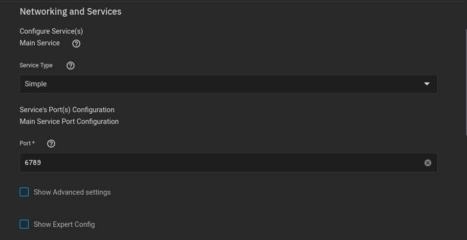
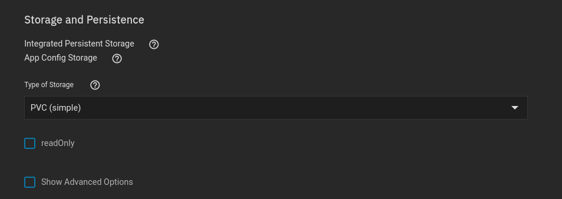

## Networking 

The setup is completely default

However, if you are wanting to use ingress, its probably better to use clusterIP instead

 

## Storage

### Configuration

The setup is also default

### Data

I always mount to the root directory of the container

