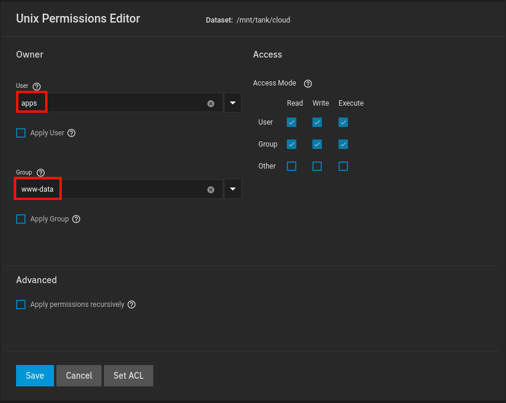

**This is the location your Nextcloud storage files will be located**

>You do NOT need to create a dataset if you do not plan on using one. Nextcloud does not require one, instead you can rely on PVC, I personally have two pools though, my apps pool, and my storage pool, so I personally want my storage, or all of my Nextcloud backups on my storage pool

??? Note "Note"
    The `apps`:`apps` user:group is built into Truenas SCALE, it is the default user for most applications on Truenas SCALE. You do not have to create a separate user for each application.

    When configuring your application you'll typically see user:group `568`, this is the UID for `apps` and its recommended not to change it.

- You are REQUIRED to use `apps:www-data` and setting the permissions exactly how I have mine, If you have anything different, chances are it will not work

 