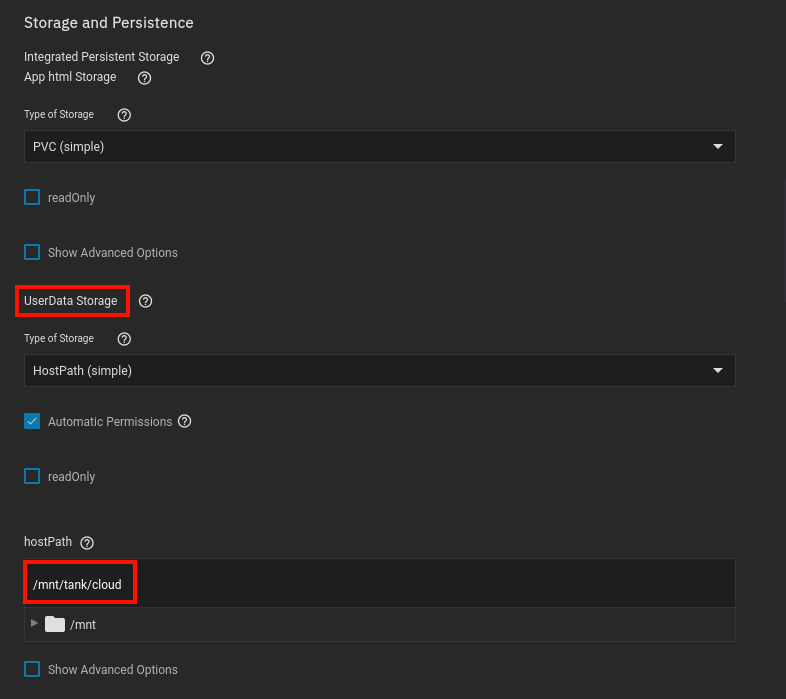

For this application I used the `Nextcloud` provided by [TrueCharts](https://truecharts.org/manual/Quick-Start%20Guides/01-Adding-TrueCharts/).

- Available under the `stable` train


<br >

## Container 

**Application Name**
```
nextcloud
```

Name it whatever you want, I stick with the chart name


**NEXTCLOUD_ADMIN_USER (First Install Only)**
```
USERNAME
```
> This is up to you

<br />

**NEXTCLOUD_ADMIN_PASSWORD (First Install Only)** 
```
PASSWORD
```
> This is up to you

<br />
<br />


## Storage
> This is an optional step, if you did not create a separate dataset, you can skip this

1. Ensure you are under `UserData Storage`
2. `Type of Storage` should be `Hostpath (simple)`
3. `Hostpath` should be the path to the dataset you created




<br />
<br />

## Ingress
> This is another optional step, if you never plan on using ingress, you can skip this.

- This is by FAR the most important thing to get right the very first time, if you fail to setup ingress on the applications VERY FIRST deployment, you will not be able to access Nextcloud via a domain name

<br >

1. Configure Hosts > Add
2. Configure Paths > Add
3. Type your hostname under `HostName`


<br >

1. Configure TLS-Settings > Add
2. Configure Certificate Hosts > Add
3. Type your hostname under `HostName`
4. Select your correct cert

> I do not add any middlewares, since Nextcloud has its own authentication, and adding middlewares breaks phone backups, since it has no way to authenticate through Authelia


<br >