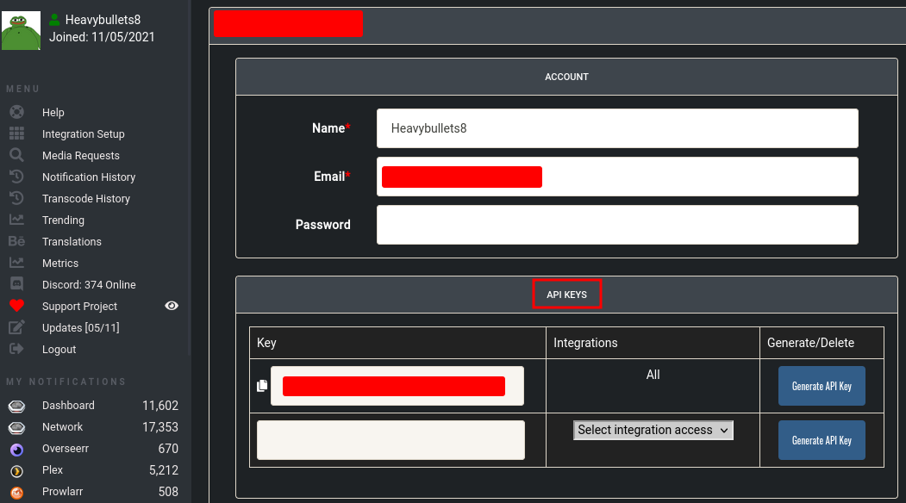
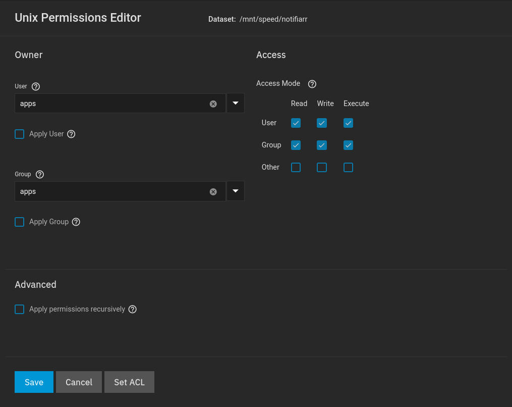

## Config File

So, this isn't as easy as just taking screenshots.. 

You'll need to go to Notifiarrs site, and look at [their documentation](https://notifiarr.wiki/en/Client/Configuration) as well

Ensure the config file is named: 

```
notifiarr.conf
```

<br >

### notifiarr.conf
```
## This API key must be copied from your notifiarr.com account.
api_key = "API_KEY_HERE"

## Setting a UI password enables the human accessible web GUI. Must be at least 16 characters.
## The default username is admin; change it by setting ui_password to "username:password"
## Set to "webauth" to disable the login form and use only proxy authentication. See upstreams, below.
## Your proxy auth must pass x-webauth-user header if you set this to "webauth".
ui_password = "USERNAME:PASSWORD"

## The ip:port to listen on for incoming HTTP requests. 0.0.0.0 means all/any IP and is recommended!
## You may use "127.0.0.1:5454" to listen only on localhost; good if using a local proxy.
## This is used to receive Plex webhooks and Media Request commands.
##
bind_addr = "0.0.0.0:54544"

## Allowed upstream networks. Networks here are allowed to send two special headers:
## (1) x-forwarded-for (2) x-webauth-user
## The first header sets the IPs in logs.
## The second header allows an auth proxy to set a logged-in username. Be careful.
##
## Set this to your reverse proxy server's IP or network. If you leave off the mask,
## then /32 or /128 is assumed depending on IP version. Empty by default. Example:
##
upstreams = ["172.16.0.0/16",]
```

??? api_key "api_key"
    1. 
        [Login to Notifiarr.com](https://notifiarr.com/profile.php)

    2. 
      Then your API key will be found here:
      

??? ui_password "ui_password"
    Make sure you read the requirements within the text above.

    It specifically says it needs:

    - A password of at LEAST 16 characters

??? bind "bind_addr"
    You need to set this to `0.0.0.0` followed by the port you wish to use

    If you follow my guide exactly, you'll end up using port `54544`

    This is the port you will access the WEBGUI from

??? upstreams "upstreams"
    This is just supposed to be your kubernetes network
    
    By default your network is `172.16.0.0/16`


<br />

## Dataset Permissions

After you have created your `notifiarr.conf` file, and filled out the required fields, you will need to create a dataset for the file to reside in

??? Note "Note"
    The `apps`:`apps` user:group is built into Truenas SCALE, it is the default user for most applications on Truenas SCALE. You do not have to create a separate user for each application.

    When configuring your application you'll typically see user:group `568`, this is the UID for `apps` and its recommended not to change it.



<br />