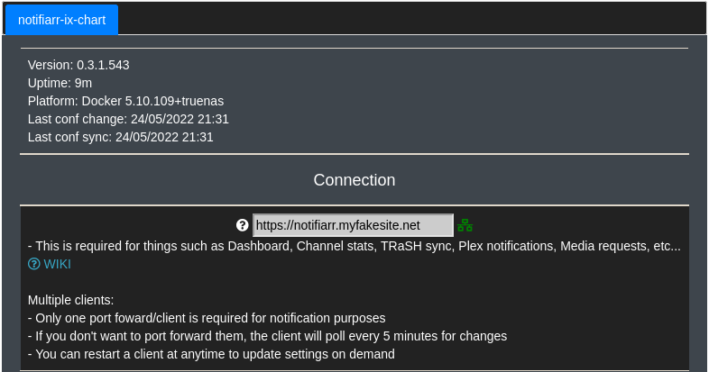
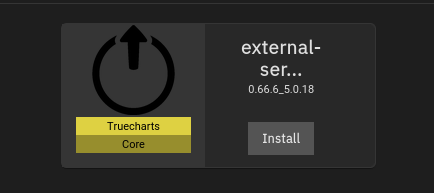
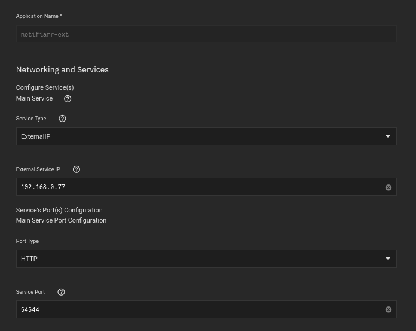
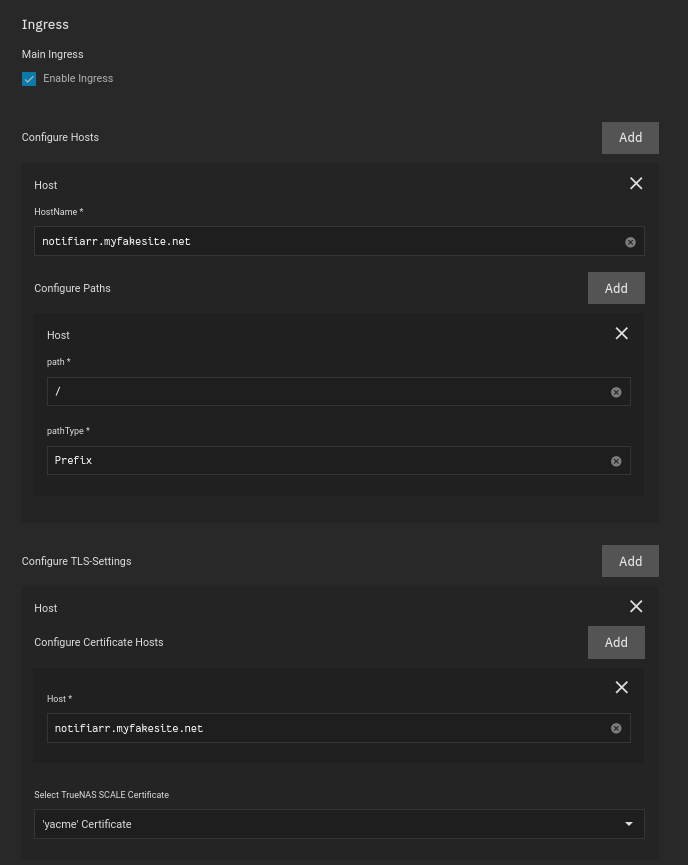

## Purpose

We want to link `external services` to notifiarr so we can use a domain name when connecting their site to our client as shown:

## External Services

You will need to launch an `external services` application, offered by Truecharts

[External-Services Documentation](https://truecharts.org/manual/Quick-Start%20Guides/11-external-services/)

## Container

`External Service IP` is the local IP address of your Truenas SCALE server

`Service Port` is the [port used by Notifiarr](https://heavysetup.info/applications/notifiarr/notifiarr/#port-forwarding)

## Ingress

 