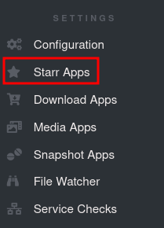
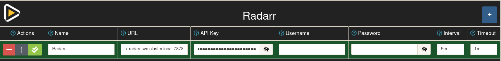
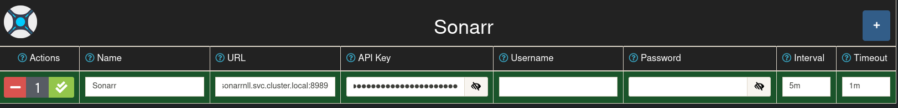
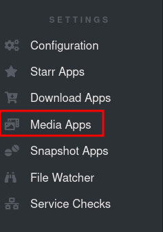
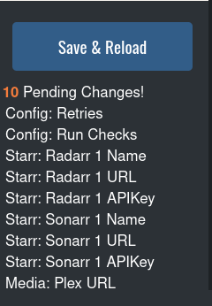

## WEBGUI Settings

1. Enter your web GUI

    Your WEBGUI should be accessible at either:

    SERVERIP:PORT   `192.168.0.77:54544`

    or 

    DOMAIN NAME     `notifiarr.myfakesite.net`

2. Enter your Username and password you set in your [configuation file](https://heavysetup.info/applications/notifiarr/datasets/#config-file)
3. Click on `configuration`

 

### Radarr

1. Go to your `Starr Apps` Setting

    

2. Click the + icon to the right of `Radarr`

3. Fill out the information:

| Name     	| Value                                          	| Reason                                                                                                                                                                                               	|
|----------	|------------------------------------------------	|------------------------------------------------------------------------------------------------------------------------------------------------------------------------------------------------------	|
| Name     	| Radarr                                         	| Doesn't matter what you call it, just call it something memorable                                                                                                                                    	|
| URL      	| http://radarr.ix-radarr.svc.cluster.local:7878 	| You will need to generate a different DNS name if your app name is not `radarr` Generate a new name with [ Truecharts Guide ]( https://truecharts.org/manual/Quick-Start%20Guides/06-linking-apps/ ) 	|
| API Key  	| APIKEYHERE                                     	| Go to Radarr > Settings > General > Under `Security` Copy your `API Key`                                                                                                                             	|
| Username 	| NULL                                           	| Not required                                                                                                                                                                                         	|
| Password 	| NULL                                           	| Not required                                                                                                                                                                                         	|

??? picture "picture"
    

 

### Sonarr

1. Go to your `Starr Apps` Setting

    

2. Click the + icon to the right of `Radarr`

3. Fill out the information:

| Name     	| Value                                                           	| Reason                                                                                                                                                                                                  	|
|----------	|-----------------------------------------------------------------	|---------------------------------------------------------------------------------------------------------------------------------------------------------------------------------------------------------	|
| Name     	| Sonarr                                                          	| Doesn't matter what you call it, just call it something memorable                                                                                                                                       	|
| URL      	| http://sonarrnll-custom-app.ix-sonarrnll.svc.cluster.local:8989 	| You will need to generate a different DNS name if your app name is not `sonarrnll` Generate a new name with [ Truecharts Guide ]( https://truecharts.org/manual/Quick-Start%20Guides/06-linking-apps/ ) 	|
| API Key  	| APIKEYHERE                                                      	| Go to Sonarr > Settings > General > Under `Security` Copy your `API Key`                                                                                                                                	|
| Username 	| NULL                                                            	| Not required                                                                                                                                                                                            	|
| Password 	| NULL                                                            	| Not required                                                                                                                                                                                            	|

??? picture "picture"
    

 

### Plex

1. Go to your `Media Apps` Setting

    

2. Click the + icon to the right of `Plex`

3. Fill out the information:

| Name       	| Value                                       	| Reason                                                                                                                                                                                             	|
|------------	|---------------------------------------------	|----------------------------------------------------------------------------------------------------------------------------------------------------------------------------------------------------	|
| Name       	| NULL                                        	| This will be filled out after refreshing your config. Leave it blank                                                                                                                               	|
| URL        	| http://plex.ix-plex.svc.cluster.local:32400 	| You will need to generate a different DNS name if your app name is not `plex` Generate a new name with [ Truecharts Guide ]( https://truecharts.org/manual/Quick-Start%20Guides/06-linking-apps/ ) 	|
| Plex Token 	| PLEX_TOKEN_HERE                             	| Plex themselves have a [ good guide ]( https://support.plex.tv/articles/204059436-finding-an-authentication-token-x-plex-token/ ) for finding your Plex token                                      	|

??? picture "picture"
    

 

## Saving

After you are done, make sure to save your configuration

- This will edit your `notifiarr.conf` file with your new settings

Click `Save & Reload`, located at the bottom left of your screen

 