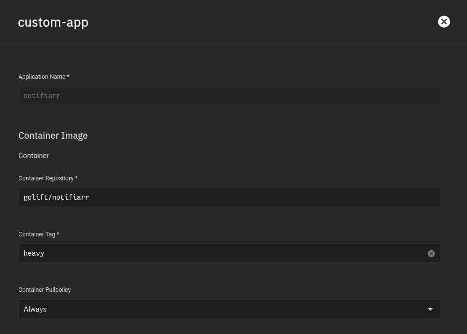
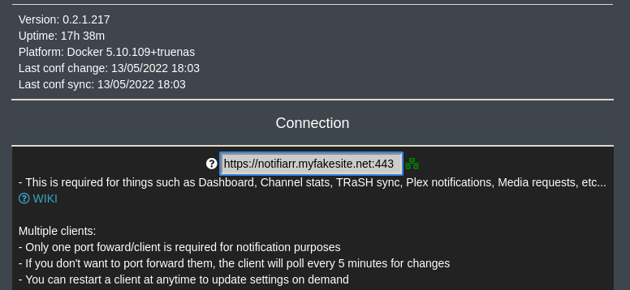
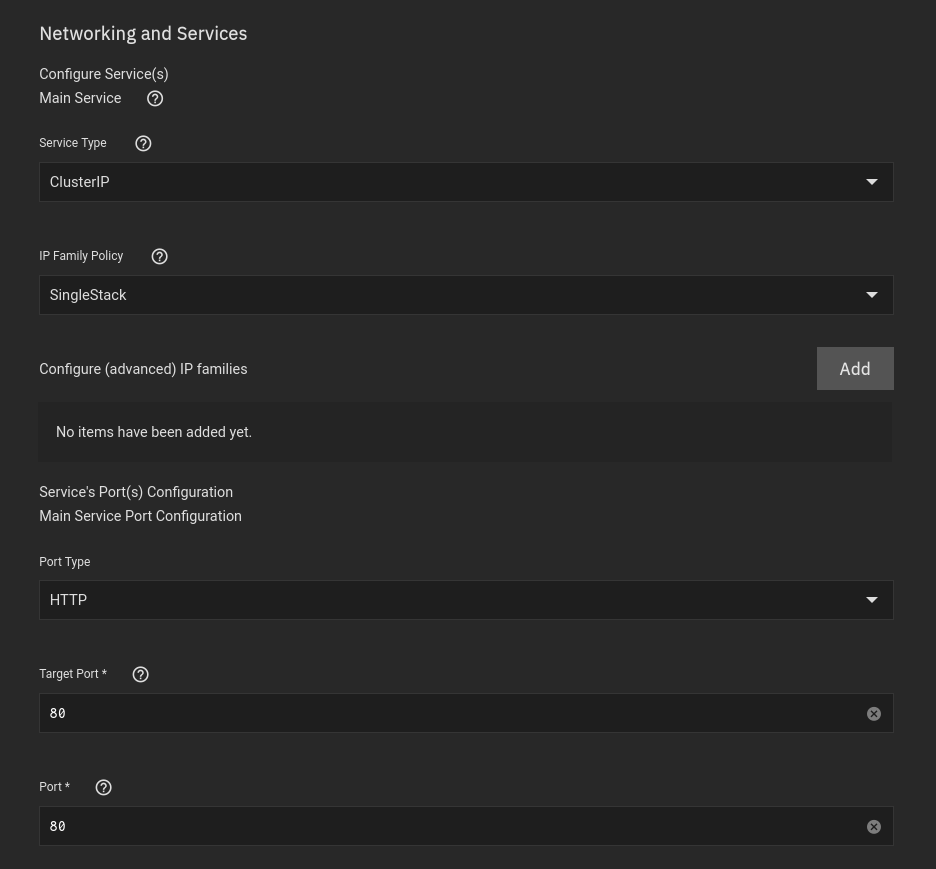
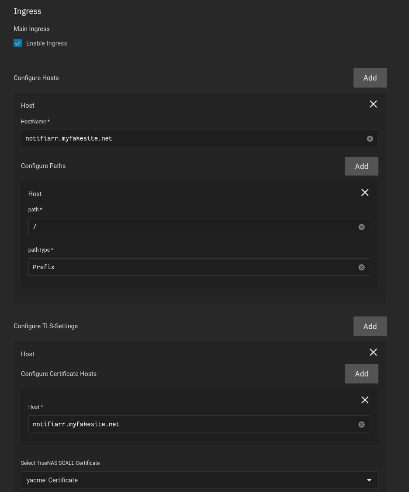

## Purpose

This is an awesome application

## Container

There is no built in Truecharts version of this application

But thats okay, we'll use Custom-app for this application instead

**Container Repository**

```
golift/notifiarr
```

**Container Tag**

```
heavy
```

We got our own tag for Kubernetes 



<br />

## Networking

- I specifically use clusterIP for this setup
    - This is so I can link notifiarr with a DNS name as shown.





<br />

## Storage


- It's important to set the mountpath as /config
- Set the path to the directory that contains your config file that you created in `Preparation`


<br />

## Ingress



<br />

## Security 


<br />