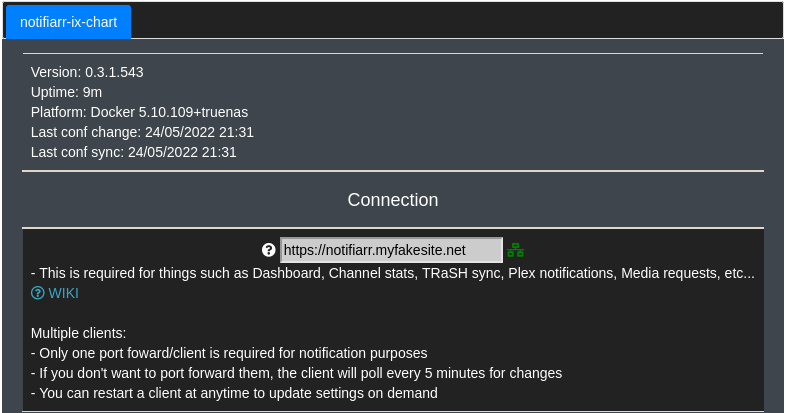
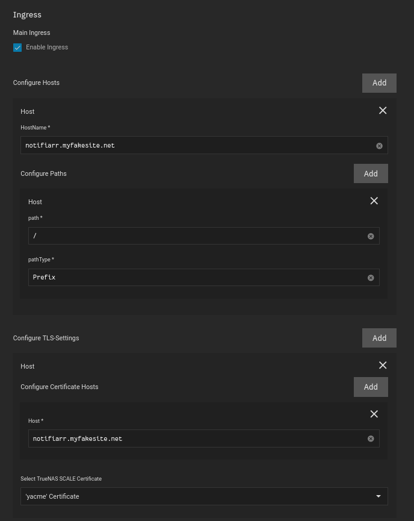

## Container

I use the big blue `Launch Docker Container` Button


<br />

**Container Repository**

```
golift/notifiarr
```

**Container Tag**

```
latest
```


<br />

## Environment Variables

Here we will be: 

- Linking notifiarr to `Plex` `Sonarr` and `Radarr`

- Passing along some tokens


### Notifiarr API Key

??? where "Where to find API Key"
    [Login to Notifiarr.com](https://notifiarr.com/profile.php)

    Then your API key will be found here:
    

**Environment Variable Name**
```
DN_API_KEY
```
**Environment Variable Value**
```
YOURAPIKEYHERE
```
??? picture "Picture"
    

<br />

### Bind Address

This is supposed to just be `0.0.0.0:YOURPORT`

If you follow [my guide](https://heavysetup.info/applications/notifiarr/installation/#port-forwarding), it will be `54544`

**Environment Variable Name**
```
DN_BIND_ADDR
```
**Environment Variable Value**
```
0.0.0.0:54544
```
??? picture "Picture"
    

<br />

### Reverse Proxy Support

This is just supposed to be your kubernetes network, by default your network is `172.16.0.0/16`

**Environment Variable Name**
```
DN_UPSTREAMS_0
```
**Environment Variable Value**
```
172.16.0.0/16
```
??? picture "Picture"
    


### Radarr

**Environment Variable Name**
```
DN_RADARR_0_NAME
```
**Environment Variable Value**
```
Radarr
```

<br />

**Environment Variable Name**
```
DN_RADARR_0_URL
```
**Environment Variable Value**
```
http://radarr.ix-radarr.svc.cluster.local:7878
```
??? notes "Notes"
    If your `Radarr` application is named ANYTHING other than `radarr`, you will need to [create your own DNS name](https://truecharts.org/manual/Quick-Start%20Guides/06-linking-apps/)

    I am also using the default port for `Radarr`, if you changed it, you need to also change the port in the value

<br />

**Environment Variable Name**
```
DN_RADARR_0_API_KEY
```
**Environment Variable Value**
```
YOURAPIKEYHERE
```

??? where "Where to find Radarr API Key"
    1. Go to Radarr
    2. Settings
    3. General
    4. Under `Security` Copy your `API Key`

<br />

??? picture "Picture"
    

<br />

### Sonarr


**Environment Variable Name**
```
DN_SONARR_0_NAME
```
**Environment Variable Value**
```
Sonarr
```

<br />

**Environment Variable Name**
```
DN_SONARR_0_URL
```
**Environment Variable Value**
```
http://sonarrnll-custom-app.ix-sonarrnll.svc.cluster.local:8989
```

??? notes "Notes"

    If your sonarr application is named `sonarr` then your DNS name is: `sonarr.ix-sonarr.svc.cluster.local` 

    If your `Sonarr` application is named ANYTHING other than `sonarrll`, you will need to [create your own DNS name](https://truecharts.org/manual/Quick-Start%20Guides/06-linking-apps/)

    I am also using the default port for `Sonarr`, if you changed it, you need to also change the port in the value


<br />

**Environment Variable Name**
```
DN_SONARR_0_API_KEY
```
**Environment Variable Value**
```
YOURAPIKEYHERE
```

??? where "Where to find Sonarr API Key"
    1. Go to Sonarr
    2. Settings
    3. General
    4. Under `Security` Copy your `API Key`

<br />

??? picture "Picture"
    

<br />

### Plex


**Environment Variable Name**
```
DN_PLEX_URL
```
**Environment Variable Value**
```
http://plex.ix-plex.svc.cluster.local:32400
```

??? notes "Notes"
    If your `Plex` application is named ANYTHING other than `plex`, you will need to [create your own DNS name](https://truecharts.org/manual/Quick-Start%20Guides/06-linking-apps/)

    I am also using the default port for `Plex`, if you changed it, you need to also change the port in the value

<br />

**Environment Variable Name**
```
DN_PLEX_TOKEN
```
**Environment Variable Value**
```
YOURAPIKEYHERE
```

??? plextoken "Where to find plex token"
    Plex themselves have a [good guide](https://support.plex.tv/articles/204059436-finding-an-authentication-token-x-plex-token/) for finding your Plex token
    

<br />

## Networking

### DNS Settings

- I use the following setting so we can use the Kubernetes DNS names when linking applications together


### Port Forwarding

Configure both `TCP` and `UDP` for `54544`
??? ports "Ports"
    Container Port
    ```
    54544
    ```
    Node Port 
    ```
    54544
    ```

    Protocol
    ```
    UDP
    ```
    <br >

    Container Port
    ```
    54544
    ```
    Node Port 
    ```
    54544
    ```

    Protocol
    ```
    TCP
    ```

We cannot use Ports Lower than 9000, which is why I did not use the default `5454` port as suggested in their documentation


<br />

## Storage

- It's important to set the mountpath as `/config`
- Set the path to the directory that contains your config file that you created in `Preparation`


<br />

## Ingress

### Purpose

We want to link `external services` to notifiarr so we can use a domain name when connecting their site to our client as shown:



### External Services

You will need to launch an `external services` application, offered by Truecharts

[External-Services Documentation](https://truecharts.org/manual/Quick-Start%20Guides/11-external-services/)


### External Services Container

`External Service IP` is the local IP address of your Truenas SCALE server

`Service Port` is the [port used by Notifiarr](https://heavysetup.info/applications/notifiarr/installation/#port-forwarding)


### External Services Ingress



<br />

## Security 


<br />