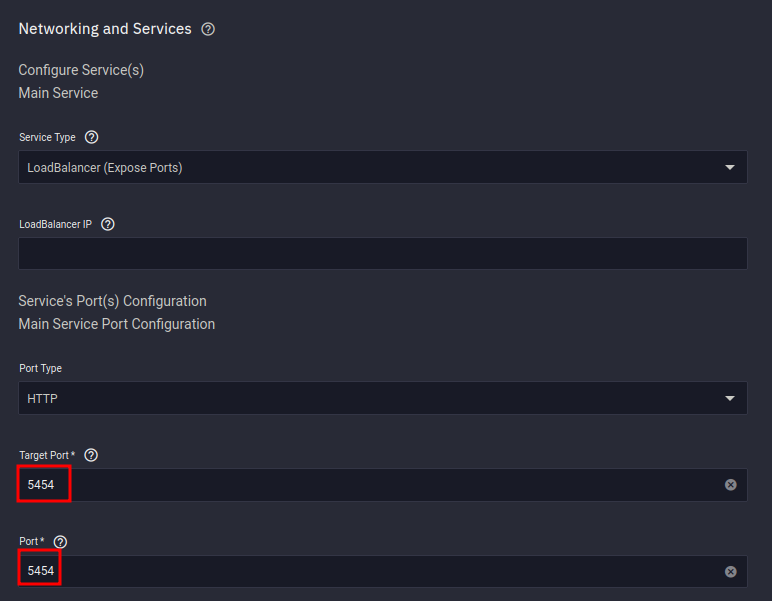

## Container

I use the big blue `Launch Docker Container` Button


<br />

**Container Repository**

```
golift/notifiarr
```

**Container Tag**

```
latest
```


<br />

## Networking

### DNS Settings

- I use the following setting so we can use the Kubernetes DNS names when linking applications together




### Port Forwarding

Container Port
```
54544
```
Node Port 
```
54544
```

Protocol
```
UDP
```
We cannot use Ports Lower than 9000, which is why I did not use the default `5454` port as suggested in their documentation


<br />

## Storage

- It's important to set the mountpath as `/config`
- Set the path to the directory that contains your config file that you created in `Preparation`


<br />

## Ingress

### Purpose

We want to link `external services` to notifiarr so we can use a domain name when connecting their site to our client as shown:


### External Services

You will need to launch an `external services` application, offered by Truecharts

[External-Services Documentation](https://truecharts.org/manual/Quick-Start%20Guides/11-external-services/)


### External Services Container

`External Service IP` is the local IP address of your Truenas SCALE server

`Service Port` is the [port used by Notifiarr](https://heavysetup.info/HeavySetup/applications/notifiarr/installation/#port-forwarding)


### External Services Ingress


<br />

## Security 


<br />