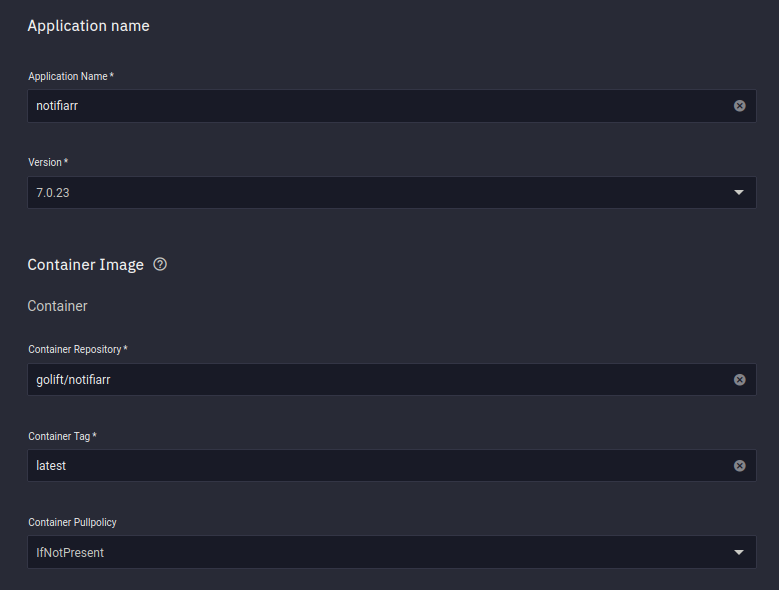

## Container

I use the big blue `Launch Docker Container` Button


<br />

**Container Repository**

```
golift/notifiarr
```

**Container Tag**

```
latest
```



<br />


## Networking

### DNS Settings

- I use the following setting so we can use the Kubernetes DNS names when linking applications together


<br >

### Port Forwarding

Configure both `TCP` and `UDP` for `54544`

We cannot use Ports Lower than 9000, which is why I did not use the default `5454` port as suggested in their documentation

Container Port
```
54544
```
Node Port 
```
54544
```

Protocol
```
UDP
```
<br >

Container Port
```
54544
```
Node Port 
```
54544
```

Protocol
```
TCP
```

??? picture "Picture"
    


<br />

## Storage

### Host Path

**Host Path**

- This is path you to the dataset you created on the [preparation page](https://heavysetup.info/applications/notifiarr/datasets/#dataset-permissions)

```
/mnt/speed/notifiarr
```

**Mount Path**

- The Mount Path is REQUIRED to be `/config`

```
/config
```

<br >

### Volume

**Mount Path**
```
/var/run/utmp
```

**Dataset Name**

- This doesnt really matter, just make sure theres no special characters in the name

```
var
```

??? picture "Picture"
    


<br />
