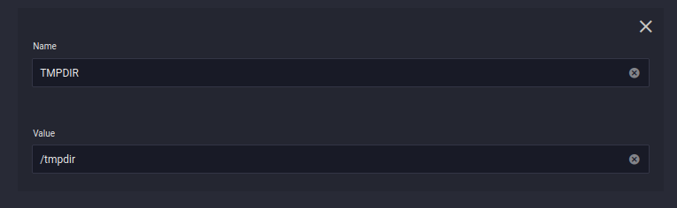
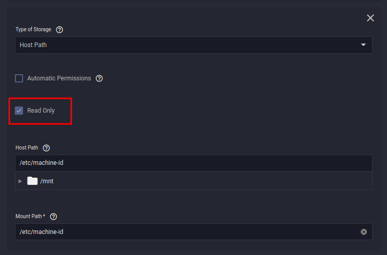
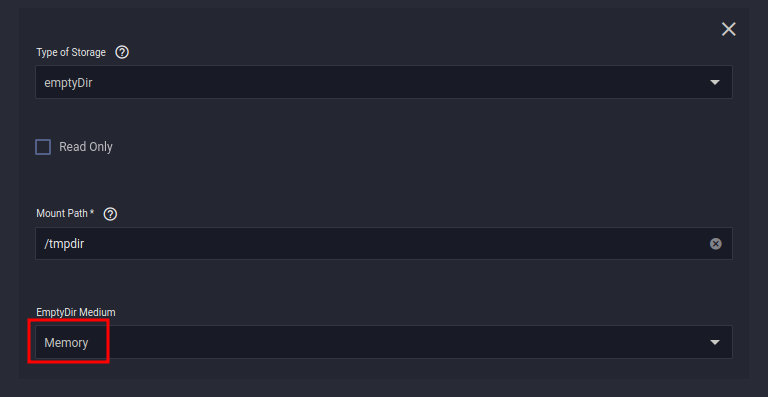

For this application I used the `Custom-App` provided by [TrueCharts](https://truecharts.org/manual/Quick-Start%20Guides/01-Adding-TrueCharts/).

- Available under the `stable` train


<br />

### Container

**Container Repository**

```
golift/notifiarr
```

**Container Tag**

```
latest
```


<br />

## Environment Variables

**Name**
```
DN_API_KEY
```
**Value**
```
API_KEY_FROM_NOTIFIARR.COM
```

> The API Key needs to be an "ALL" integrations key. You can find this on your profile page on 
[notifiarr.com](https://notifiarr.com/user.php?page=profile "Click to visit the profile page") 

??? picture "API Key Location"
    

<br >

**Name**
```
DN_UPSTREAMS_0
```
**Value**
```
172.16.0.0/16
```
> This is the default range of the kubernetes network for TrueNAS SCALE

> You also can add your local network range here as well


<br >

**Name**
```
TMPDIR
```
**Value**
```
/tmpdir
```

> This is an optional environment variable. It is used to set the temporary directory for checking your *arr applications databases for corruption.

> I highly reccomend running this and enabling the database checks on notifiarr.com



<br />

## Networking

**Target Port**
```
5454
```

**Port**
```
5454
```


<br >


## Ingress

> This is optional, but I recommend it. It is a lot better than using the port forwarding method.


<br />

## Storage

### PVC's

Here we are just going to make two Persistent Volumes. One for the config and one for utmp.

**Mount Path**
```
/config
```

**Mount Path**
```
/var/run/utmp
```


<br >

### Host Path

**Host Path**
```
/etc/machine-id
```
**Mount Path**
```
/etc/machine-id
```

> Also ensure *Read Only* is checked




<br >


### emptyDir


**Mount Path**
```
/tmpdir
```

> I use EmptyDir Medium as Memory, meaning the database checks will be verified in ram. The databases are small enough (in the mb's) that this is not an issue. 

> Also ensure the mount path matches the **TMPDIR** environment variable




<br >

## Username and Password

### Find your credentials

> After you click save, the container will deploy for the first time. you absolutely need to check the logs, because your username and password will be in there. 


View your logs


Copy your username and password


### Set your credentials


> After you have your username and password, you can change them in the WebGUI if you want.


