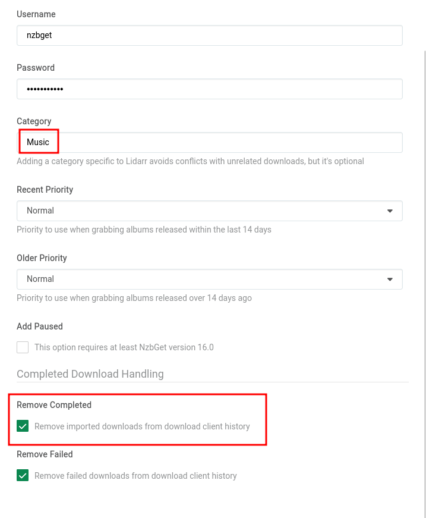
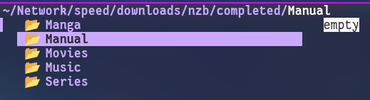

Keep in mind, these are just my personal settings, if you are wanting a more in-depth example, check out [TRaSH Guides: NZBGet Documentation](https://trash-guides.info/Downloaders/NZBGet/Basic-Setup/)

<br />

## Paths

**MainDir**
```
/nzb
```

**ScriptDir**
```
${MainDir}/scripts
```

<br />

## Security

**ControlPassword**
```
NEWPASSWORD
```

- set this to something I will personally use

**AuthorizedIP**
```
127.0.0.1,192.168.0.*,172.16.*.*
```

- This field is separated by commas.
- I added my Lan on there `192.168.0.*`
- As well as the kubernetes Network `172.16.*.*` 

<br />

## Catagories

I use 5 catagories

- `Movies` is used by:

??? Radarr "Radarr"

    - I also always enable `Remove Completed` for NZBs 

    

- `Series` is used by:

??? Sonarr "Sonarr"

    - I also always enable `Remove Completed` for NZBs 

    
    
- `Music` is used by:

??? Lidarr "Lidarr"

    - I also always enable `Remove Completed` for NZBs 

    

- `Manual` is ignored by all of my applications and only for my personal use
    
- `Manga` is for Komga
    - Komga doesn't automatically import, I just decided to give it its own category anyway
    


While creating these catagories, I _ONLY_ changed the name, no other field was changed, the files once completed, will still go into their own directory as shown below.



<br />

## Extension Scripts

**Extensions**
```
Clean.py, HashRenamer.py, Flatten.py
```

**Script Order**
```
Clean.py, Flatten.py, HashRenamer.py
```

As long as the scripts are in your scripts directory you should be set


<br />

Here is the code for the extensions I use, make sure to copy and paste them with the `.py` extensions and place them into your `scripts` folder

??? Code "Clean.py"
    More info can be found [by TRaSH Guides](https://trash-guides.info/Downloaders/NZBGet/scripts/)
    ```
    #!/usr/bin/env python3
    #

    ##############################################################################
    ### NZBGET SCAN SCRIPT                                                     ###

    # Clean NZB name.
    #
    # Removes the following suffixes from NZB name:
    # NZBgeek / Obfuscated / BUYMORE / Scrambled.
    #
    # NOTE: This script requires Python to be installed on your system.

    ### NZBGET SCAN SCRIPT                                                     ###
    ##############################################################################

    from __future__ import print_function
    import os, re, sys

    # Exit codes used by NZBGet
    POSTPROCESS_SUCCESS=93
    POSTPROCESS_ERROR=94
    POSTPROCESS_SKIP=95

    # Check if the script is called from NZBGet 13.0 or later
    if not 'NZBOP_SCRIPTDIR' in os.environ:
    print('*** NZBGet post-processing script ***')
    print('This script is supposed to be called from NZBGet (13.0 or later).')
    sys.exit(POSTPROCESS_ERROR)

    if not 'NZBNP_NZBNAME' in os.environ:
    print('[WARN] Filename not found in environment')
    sys.exit(POSTPROCESS_ERROR)

    fwp = os.environ['NZBNP_NZBNAME']
    fwp = re.sub('(?i)-4P\.nzb$', '.nzb', fwp)
    fwp = re.sub('(?i)-4Planet\.nzb$', '.nzb', fwp)
    fwp = re.sub('(?i)-AsRequested\.nzb$', '.nzb', fwp)
    fwp = re.sub('(?i)-AsRequested-xpost\.nzb$', '.nzb', fwp)
    fwp = re.sub('(?i)-BUYMORE\.nzb$', '.nzb', fwp)
    fwp = re.sub('(?i)-Chamele0n\.nzb$', '.nzb', fwp)
    fwp = re.sub('(?i)-GEROV\.nzb$', '.nzb', fwp)
    fwp = re.sub('(?i)-iNC0GNiTO\.nzb$', '.nzb', fwp)
    fwp = re.sub('(?i)-NZBGeek\.nzb$', '.nzb', fwp)
    fwp = re.sub('(?i)-Obfuscated\.nzb$', '.nzb', fwp)
    fwp = re.sub('(?i)-postbot\.nzb$', '.nzb', fwp)
    fwp = re.sub('(?i)-Rakuv\.nzb$', '.nzb', fwp)
    fwp = re.sub('(?i)-Scrambled\.nzb$', '.nzb', fwp)
    fwp = re.sub('(?i)-WhiteRev\.nzb$', '.nzb', fwp)
    fwp = re.sub('(?i)-xpost\.nzb$', '.nzb', fwp)
    fwp = re.sub('(?i)\[eztv\]\.nzb$', '.nzb', fwp)
    fwp = re.sub('(?i)\[TGx\]\.nzb$', '.nzb', fwp)
    fwp = re.sub('(?i)\[TGx\]-xpost\.nzb$', '.nzb', fwp)
    fwp = re.sub('(?i)\[ettv\]\.nzb$', '.nzb', fwp)
    fwp = re.sub('(?i)-WRTEAM\.nzb$', '.nzb', fwp)
    fwp = re.sub('(?i)-CAPTCHA\.nzb$', '.nzb', fwp)
    fwp = re.sub(r'(\-[^-.\n]*)(\-.{4})?\.nzb$', r'\1.nzb', fwp)
    if fwp:
    print('[NZB] NZBNAME=', fwp, sep='')

    sys.exit(POSTPROCESS_SUCCESS)
    ```

??? Code "Flatten.py"
    This removes all of the sub-folders created by the unpack process

    More info can be found [on the GitHub source](https://github.com/clinton-hall/GetScripts)
    ```
    #!/usr/bin/env python
    #
    ##############################################################################
    ### NZBGET POST-PROCESSING SCRIPT                                          ###

    # Flatten all downloaded files into the root download directory.
    #
    # This removes all of the sub-folders created by the unpack process.
    # This should run before other scripts.
    #
    # NOTE: This script requires Python to be installed on your system.
    ##############################################################################
    ### OPTIONS                                                                ###

    # Destination Directory.
    #
    # Set the directory where you want all files to be moved to.
    # Use this if you want all downloaded files in a single "root" directory.
    # If left blank, files will all be "flattened" into the individual download's sub-directory.
    #DestinationDirectory=

    # Append Categories (yes, no).
    # 
    # If using the Destination Directory above, then this option will append the download category.
    #AppendCategories=no


    ### NZBGET POST-PROCESSING SCRIPT                                          ###
    ##############################################################################
    import os
    import sys
    import shutil

    # NZBGet Exit Codes
    NZBGET_POSTPROCESS_PARCHECK = 92
    NZBGET_POSTPROCESS_SUCCESS = 93
    NZBGET_POSTPROCESS_ERROR = 94
    NZBGET_POSTPROCESS_NONE = 95

    if 'NZBOP_SCRIPTDIR' not in os.environ:
        print("This script can only be called from NZBGet (11.0 or later).")
        sys.exit(0)

    if os.environ['NZBOP_VERSION'][0:5] < '11.0':
        print("[ERROR] NZBGet Version %s is not supported. Please update NZBGet." % (str(os.environ['NZBOP_VERSION'])))
        sys.exit(0)

    print("Script triggered from NZBGet Version %s." % (str(os.environ['NZBOP_VERSION'])))
    status = 0
    if 'NZBPP_TOTALSTATUS' in os.environ:
        if not os.environ['NZBPP_TOTALSTATUS'] == 'SUCCESS':
            print("[ERROR] Download failed with status %s." % (os.environ['NZBPP_STATUS']))
            status = 1

    else:
        # Check par status
        if os.environ.get('NZBPP_PARSTATUS') == '1' or os.environ.get('NZBPP_PARSTATUS') == '4':
            print("[ERROR] Par-repair failed, setting status \"failed\".")
            status = 1

        # Check unpack status
        if os.environ.get('NZBPP_UNPACKSTATUS') == '1':
            print("[ERROR] Unpack failed, setting status \"failed\".")
            status = 1

        if os.environ.get('NZBPP_UNPACKSTATUS') == '0' and os.environ.get('NZBPP_PARSTATUS') == '0':
            # Unpack was skipped due to nzb-file properties or due to errors during par-check

            if os.environ.get('NZBPP_HEALTH') < 1000:
                print("[ERROR] Download health is compromised and Par-check/repair disabled or no .par2 files found. Setting status \"failed\".")
                print("[ERROR] Please check your Par-check/repair settings for future downloads.")
                status = 1

            else:
                print("[ERROR] Par-check/repair disabled or no .par2 files found, and Unpack not required. Health is ok so handle as though download successful.")
                print("[WARNING] Please check your Par-check/repair settings for future downloads.")

    # Check if destination directory exists (important for reprocessing of history items)
    if not os.path.isdir(os.environ.get('NZBPP_DIRECTORY')):
        print("[ERROR] Nothing to post-process: destination directory", os.environ['NZBPP_DIRECTORY'], "doesn't exist. Setting status \"failed\".")
        status = 1

    # All checks done, now launching the script.
    if status == 1:
        sys.exit(NZBGET_POSTPROCESS_NONE)

    def removeEmptyFolders(path, removeRoot=True):
        #Function to remove empty folders
        if not os.path.isdir(path):
            return

        # remove empty subfolders
        print("[INFO] Checking for empty folders in:%s" % path)
        files = os.listdir(path)
        if len(files):
            for f in files:
                fullpath = os.path.join(path, f)
                if os.path.isdir(fullpath):
                    removeEmptyFolders(fullpath)

        # if folder empty, delete it
        files = os.listdir(path)
        if len(files) == 0 and removeRoot:
            print("[INFO] Removing empty folder:%s" % path)
            os.rmdir(path)

    directory = os.path.normpath(os.environ.get('NZBPP_DIRECTORY'))
    if os.environ.get('NZBPO_DESTINATIONDIRECTORY', False) and os.path.isdir(os.environ.get('NZBPO_DESTINATIONDIRECTORY')):
        destination = os.environ.get('NZBPO_DESTINATIONDIRECTORY')
        if os.environ.get('NZBPO_APPENDCATEGORIES') == 'yes':
            destination = os.path.join(destination, os.environ.get('NZBPP_CATEGORY'))
    else:
        destination = directory
    print("Flattening directory: %s" % (directory))
    for dirpath, dirnames, filenames in os.walk(directory):
        for fileName in filenames:
            outputFile = os.path.join(dirpath, fileName)
            if dirpath == destination:
                continue
            target = os.path.join(destination, fileName)
            try:
                shutil.move(outputFile, target)
            except:
                print("[ERROR] Could not flatten %s" % outputFile)
    removeEmptyFolders(directory)  # Cleanup empty directories
    sys.exit(NZBGET_POSTPROCESS_SUCCESS)
    ```


??? Code "HashRenamer.py"
    More info can be found [by TRaSH Guides](https://trash-guides.info/Downloaders/NZBGet/scripts/)
    ```
    #!/usr/bin/env python3
    #
    ##############################################################################
    # Title:         HashRenamer.py                                              #
    # Author(s):     l3uddz, desimaniac                                          #
    # URL:           https://github.com/l3uddz/nzbgetScripts                     #
    # Description:   Renames hashed media files to match the source NZB.         #
    # --                                                                         #
    #            Part of the Cloudbox project: https://cloudbox.works            #
    ##############################################################################

    ##############################################################################
    #  Built on top of the NZBGet scripts template created by Clinton Hall       #
    #    (https://github.com/clinton-hall).                                      #
    #  Released under GNU General Public License v2.0                            #
    ##############################################################################


    ##############################################################################
    ### NZBGET POST-PROCESSING SCRIPT                                          ###

    # Rename files with hashes for file name
    #
    # NOTE: This script requires Python to be installed on your system.
    #
    ##############################################################################
    ### NZBGET POST-PROCESSING SCRIPT                                          ###
    ##############################################################################

    import os
    import re
    import shutil
    import sys

    # NZBGet Exit Codes
    NZBGET_POSTPROCESS_PARCHECK = 92
    NZBGET_POSTPROCESS_SUCCESS = 93
    NZBGET_POSTPROCESS_ERROR = 94
    NZBGET_POSTPROCESS_NONE = 95


    ############################################################
    # EXTENSION STUFF
    ############################################################

    def do_check():
        if 'NZBOP_SCRIPTDIR' not in os.environ:
            print("This script can only be called from NZBGet (11.0 or later).")
            sys.exit(0)

        if os.environ['NZBOP_VERSION'][0:5] < '11.0':
            print("[ERROR] NZBGet Version %s is not supported. Please update NZBGet." % (str(os.environ['NZBOP_VERSION'])))
            sys.exit(0)

        print("Script triggered from NZBGet Version %s." % (str(os.environ['NZBOP_VERSION'])))

        status = 0
        if 'NZBPP_TOTALSTATUS' in os.environ:
            if not os.environ['NZBPP_TOTALSTATUS'] == 'SUCCESS':
                print("[ERROR] Download failed with status %s." % (os.environ['NZBPP_STATUS']))
                status = 1
        else:
            # Check par status
            if os.environ['NZBPP_PARSTATUS'] == '1' or os.environ['NZBPP_PARSTATUS'] == '4':
                print("[ERROR] Par-repair failed, setting status \"failed\".")
                status = 1

            # Check unpack status
            if os.environ['NZBPP_UNPACKSTATUS'] == '1':
                print("[ERROR] Unpack failed, setting status \"failed\".")
                status = 1

            if os.environ['NZBPP_UNPACKSTATUS'] == '0' and os.environ['NZBPP_PARSTATUS'] == '0':
                # Unpack was skipped due to nzb-file properties or due to errors during par-check

                if os.environ['NZBPP_HEALTH'] < 1000:
                    print("[ERROR] Download health is compromised and Par-check/repair disabled or no .par2 files found. " \
                        "Setting status \"failed\".")
                    print("[ERROR] Please check your Par-check/repair settings for future downloads.")
                    status = 1

                else:
                    print("[ERROR] Par-check/repair disabled or no .par2 files found, and Unpack not required. Health is " \
                        "ok so handle as though download successful.")
                    print("[WARNING] Please check your Par-check/repair settings for future downloads.")

        # Check if destination directory exists (important for reprocessing of history items)
        if not os.path.isdir(os.environ['NZBPP_DIRECTORY']):
            print("[ERROR] Nothing to post-process: destination directory", os.environ[
                'NZBPP_DIRECTORY'], "doesn't exist. Setting status \"failed\".")
            status = 1

        # All checks done, now launching the script.
        if status == 1:
            sys.exit(NZBGET_POSTPROCESS_NONE)


    def get_file_name(path):
        try:
            file_name = os.path.basename(path)
            extensions = re.findall(r'\.([^.]+)', file_name)
            ext = '.'.join(extensions)
            name = file_name.replace(".%s" % ext, '')
            return name, ext
        except Exception:
            pass
        return None


    def is_file_hash(file_name):
        hash_regexp = [
            r'^[a-fA-F0-9]{40}$',
            r'^[a-fA-F0-9]{32}$',
            r'^[a-f0-9]{128}$',
            r'^[a-zA-Z0-9]{42}$'
        ]
        for hash in hash_regexp:
            if re.match(hash, file_name):
                return True
        return False


    def find_files(folder, extension=None, depth=None):
        file_list = []
        start_count = folder.count(os.sep)
        for path, subdirs, files in os.walk(folder, topdown=True):
            for name in files:
                if depth and path.count(os.sep) - start_count >= depth:
                    del subdirs[:]
                    continue
                file = os.path.join(path, name)
                if not extension:
                    file_list.append(file)
                else:
                    if file.lower().endswith(extension.lower()):
                        file_list.append(file)

        return sorted(file_list, key=lambda x: x.count(os.path.sep), reverse=True)


    ############################################################
    # MAIN
    ############################################################

    # do checks
    do_check()

    # retrieve required variables
    directory = os.path.normpath(os.environ['NZBPP_DIRECTORY'])
    nzb_name = os.environ['NZBPP_NZBFILENAME']
    if nzb_name is None:
        print("[ERROR] Unable to retrieve NZBPP_NZBFILENAME")
        sys.exit(NZBGET_POSTPROCESS_ERROR)
    nzb_name = nzb_name.replace('.nzb', '')

    print(("[INFO] Using \"%s\" for hashed filenames" % nzb_name))
    print(("[INFO] Scanning \"%s\" for hashed filenames" % directory))

    # scan for files
    found_files = find_files(directory)
    if not found_files:
        print(("[INFO] No files were found in \"%s\"" % directory))
        sys.exit(NZBGET_POSTPROCESS_NONE)
    else:
        print(("[INFO] Found %d files to check for hashed filenames" % len(found_files)))
        # loop files checking for file hash
        moved_files = 0
        for found_file_path in found_files:
            # set variable
            dir_name = os.path.dirname(found_file_path)
            file_name, file_ext = get_file_name(found_file_path)

            # is this a file hash
            if is_file_hash(file_name):
                new_file_path = os.path.join(dir_name, "%s.%s" % (nzb_name, file_ext))
                print(("[INFO] Moving \"%s\" to \"%s\"" % (found_file_path, new_file_path)))
                try:
                    shutil.move(found_file_path, new_file_path)
                    moved_files += 1
                except Exception:
                    print(("[ERROR] Failed moving \"%s\" to \"%s\"" % (found_file_path, new_file_path)))

        print(("[INFO] Finished processing \"%s\", moved %d files" % (directory, moved_files)))

    sys.exit(NZBGET_POSTPROCESS_SUCCESS)
    ```