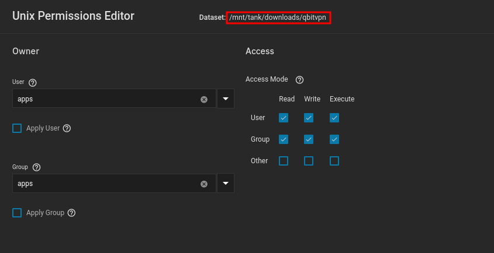

**This is the location your completed bittorrent files will be located**

Typical setting user:group to `apps`, nothing fancy here

- Placed the created `nzb` dataset within the `downloads` folder

??? Note "Note"
    The `apps`:`apps` user:group is built into Truenas SCALE, it is the default user for most applications on Truenas SCALE. You do not have to create a separate user for each application.

    When configuring your application you'll typically see user:group `568`, this is the UID for `apps` and its recommended not to change it.

 