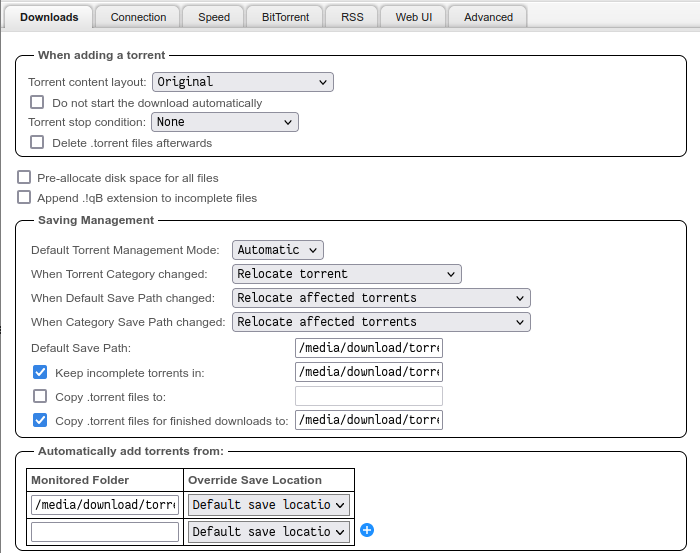
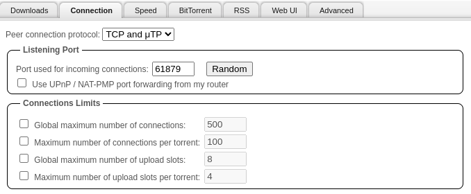
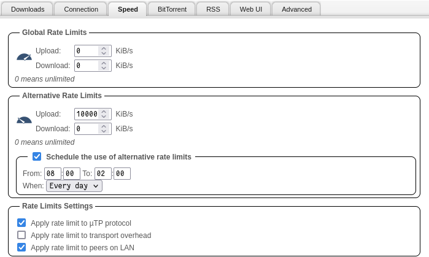
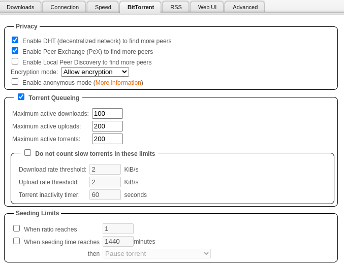
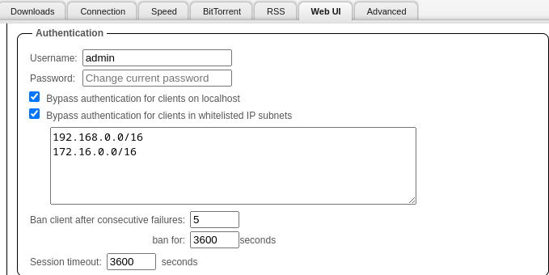
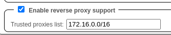
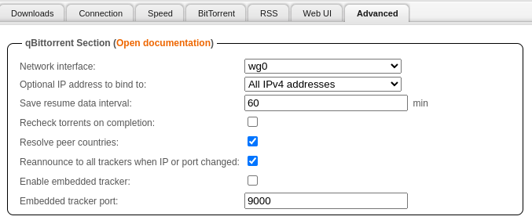

## Downloads


??? qBittorrent "qBittorrent Table + Explanation" 

    |          Setting           	                    |         Value          	    |          Explanation                                	                            |
    |------------------------------------------------	|----------------------------	|----------------------------------------------------------------------------------	|
    | Default Torrent Management Mode:                  | Automatic                     | This is to automatically move the files torrents based on catagory                |
    | When Torrent Category changed:                 	| Relocate Torrent           	| This is to automatically move the files torrents based on catagory               	|
    | When Default Save Path changed:                	| Relocate Affected Torrents 	| This is to automatically move the files torrents based on catagory               	|
    | When Category Save Path changed:               	| Relocate Affected Torrents 	| This is to automatically move the files torrents based on catagory               	|
    | Default Save Path:                             	| `/media/download/torrent/complete`         	| Set this to what you set your dataset mountpoint as                              	|
    | Keep incomplete torrents in:                   	| `/media/download/torrent/temp`              	| Keep incomplete torrents in a folder no apps are monitoring                      	|
    | Copy .torrent files for finished downloads to: 	| `/media/download/torrent/backup`            	| Its nice to have a backup folder of all your `.torrents` in the event of a crash 	|
    | Monitored Folder                               	| `/media/download/torrent/monitor`           	| Place `.torrent` files in this directory to automatically start those torrents   	|




<br >

## Connection

This should equal to your listening port you set [during the installation](https://heavysetup.info/applications/qbittorrent/installation/#listening-ports)



<br >

## Speed

- Set `Alternative Rate Limits` to `10000` KiB
    - This is so during the day, or when users are using my Plex server, my qBittorrent instance isn't using _ALL_ of my bandwidth seeding

- Set my schedule from `08:00` to `02:00`
    - 8am to 2am, which is around the time users are watching Plex



<br >

## BitTorrent

- Disabled `Local Peer Discovery`
    - This is only useful if you are on a huge network, like a college campus or something like that




<br >

## WebGUI 

- Changed the password to something I would remember

Added both my LAN and Kubernetes LAN to the bypass list, this way neither of them have to authenticate, it gets annoying to log in over and over on your own network

**Bypass authentication for clients in whitelisted IP subnets**
```
192.168.0.0/16
172.16.0.0/16
```



Since I am using `Traefik`, I decided to add the Kubernetes LAN to:

**Enable reverse proxy support**
```
172.16.0.0/16
```




<br >

## Advanced


??? qBittorrent "qBittorrent Table + Explanation" 

    |          Setting           	                                        |         Value         |          Explanation                                	                                |
    |------------------------------------------------	                    |-----------------------|----------------------------------------------------------------------------------	    |
    | Network interface:                                                   	| `wg0` or `tun0`       | Bind this to `wg0` or `tun0` if you are using Wireguard (wg0) or Openvpn(tun0)        |
    | Optional IP address to bind to:                                      	| All Ipv4 Addresses 	| Kubernetes doesnt support ipv6 now anyway so, I set this to just ipv4               	|
    | Resolve peer countries:                                              	| True               	| Just so I can see what countries I am leeching/seeding from                         	|
    | Reannounce to all trackers when IP or port changed:                  	| True               	| In the event my IP or port changes, I want everyone to know, so I can seed or leech 	|



<br >