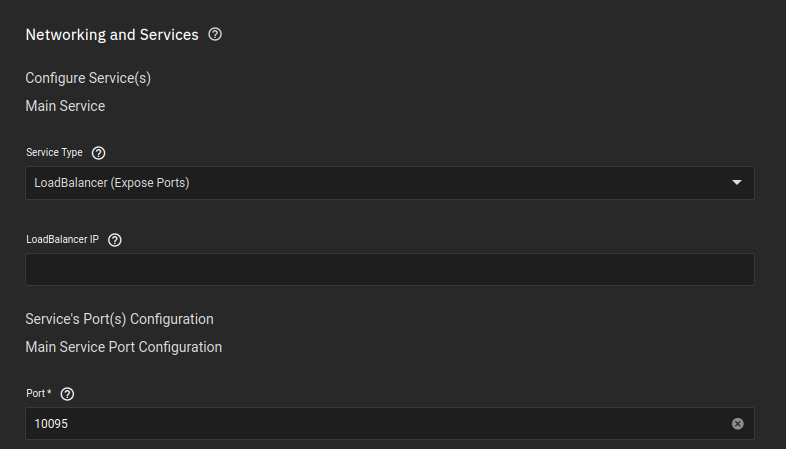
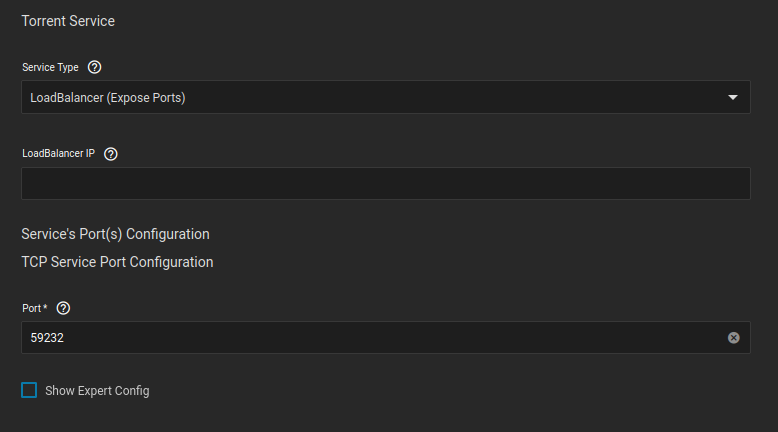
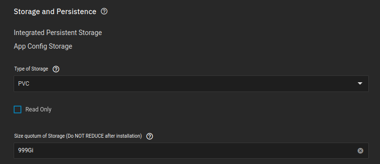
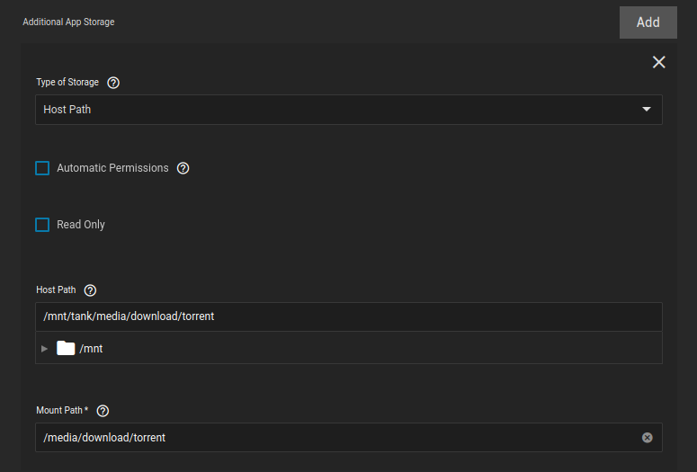
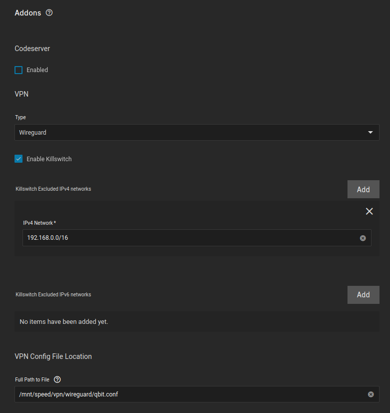

## Networking 

### WebGUI

I left this default since there was no reason for me to change the WebGUI port

This is ALSO the port Sonarr/Radarr and other services will use to connect to qBittorrent




### Listening Ports

??? VPN "With VPN"
    - No need to port forward on your router
    - If you want fast seeding, you will need a service that supports port forwarding
    - I use Mullvad, and changed the port below to the port that was allocated to me by Mullvad

??? NOVPN "Without VPN"
    - You can leave the port default without a VPN
    - If you want fast seeding though, you will need to port forward this port on your router



<br />

## Storage

### Configuration

The setup is default



### Data

- media is the dataset I created for my media here: [Dataset Creation](https://heavysetup.info/general_guides/folder_structure/dataset/)
- media is also the dataset that hosts all nested folders for my media, as shown in the tree structure here: [Folder Structure](https://heavysetup.info/general_guides/folder_structure/about/#tree)
- Qbittorrent only needs to access the `/media/download/torrent` folder, so I gave it access to that folder only
--NOTE-- If you are using a path that is shared with an SMB share, the app will get stuck deploying. The work around is to turn off the share for that path, launch the app, after it successfully deploys you can turn the SMB share back on.
- Sonarr/Radarr will be able to hardlink files from the download directory, since they both will be seeing the folders they require

??? info "qBittorrents Scope"
    ```
    media (dataset) 
    ├── download
    │   ├── usenet
    │   ├── syncthing
    │   └── torrent <Has access to everything below here>
    ├── library
    │   ├── movies
    │   │     ├── anime
    │   │     ├── kids
    │   │     └── standard
    │   ├── series
    │   │     ├── anime
    │   │     ├── kids
    │   │     └── standard
    │   └── music
    ```



<br />

## VPN

- Using a Wireguard setup
- Add your LAN network to the killswitch section (the internal 172.16.0.0/12 isn't necessary anymore)



<br />
