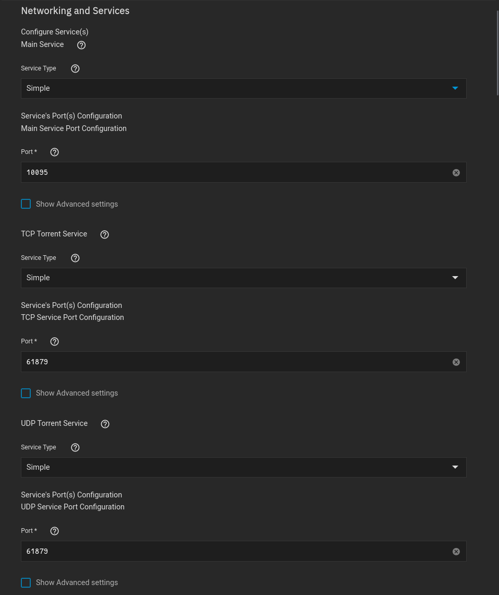

## Networking 

If you are wanting to use ingress, its probably better to use `clusterIP` instead of `Simple`

### WebGUI

I left this default since there was no reason for me to change the WebGUI port

This is ALSO the port Sonarr/Radarr and other services will use to connect to qBittorrent

### Listening Ports

??? VPN "With VPN"
    - No need to port forward on your router
    - If you want fast seeding, you will need a service that supports port forwarding
    - I use Mullvad, and changed the two ports below to the port that was allocated to me by Mullvad

??? NOVPN "Without VPN"
    - You can leave the two ports default without a VPN
    - If you want fast seeding though, you will need to port forward this port on your router

 

## Storage

### Configuration

The setup is default

### Data

I always mount to the root directory of the container

I also try to use the applications name for the mountpath, since its typically never going to be a file or folder thats already present 

 

## VPN

- Using a Wireguard setup
- Added the kubernetes network, as well as my LAN network to the killswitch

 