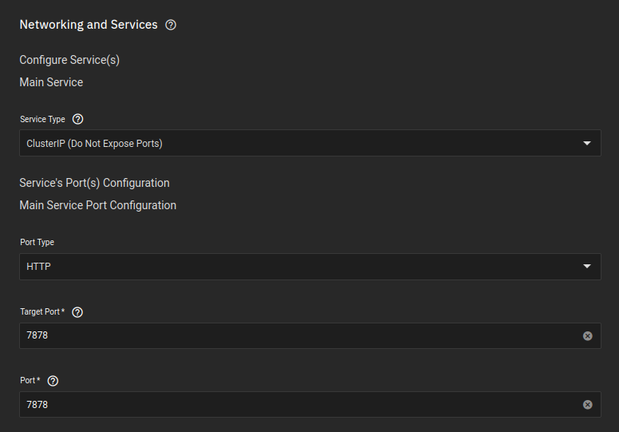
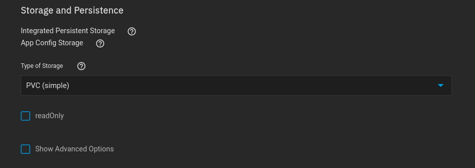
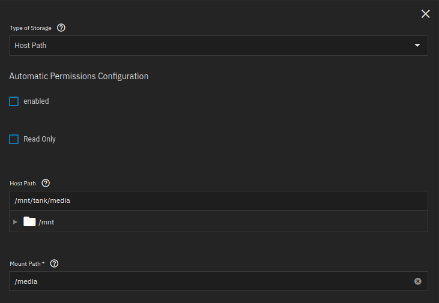
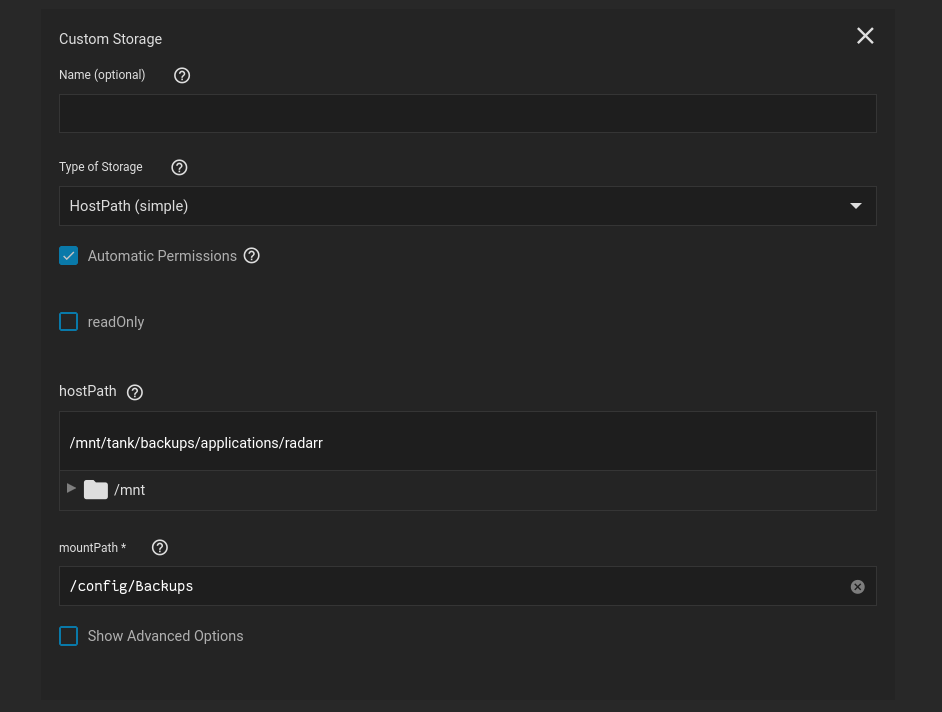
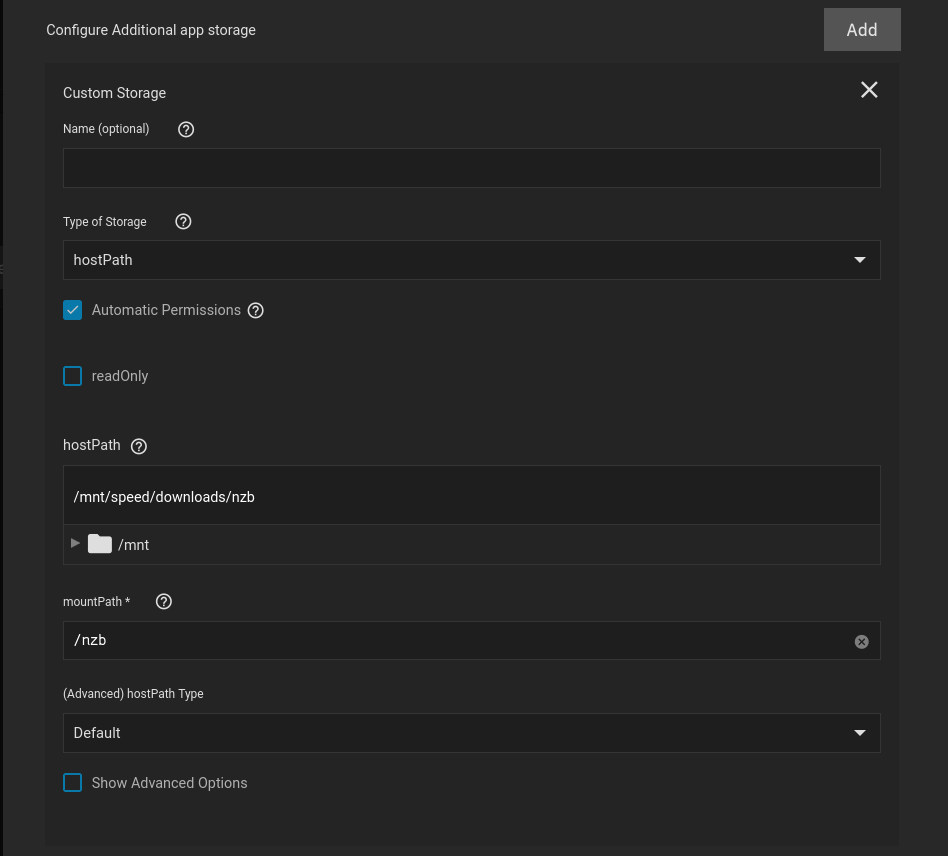
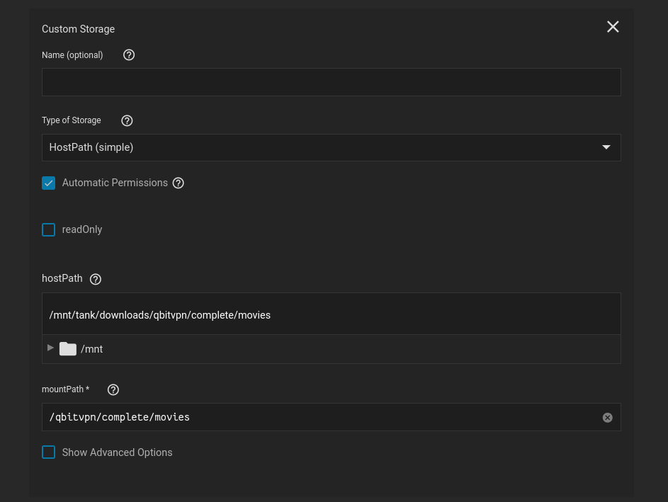
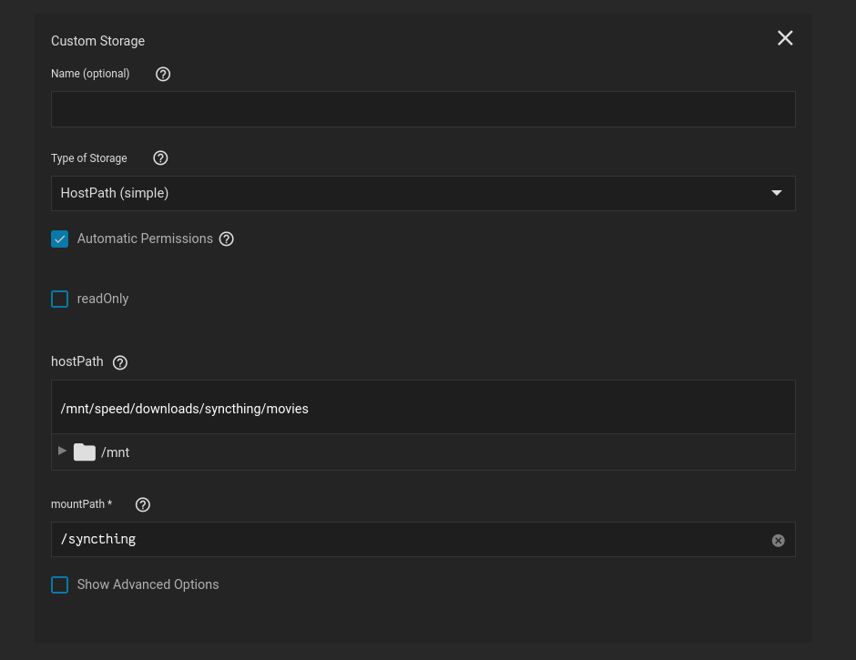

## Networking 

If you are wanting to use ingress, its probably better to use clusterIP instead

- I changed the UDP and TCP port to match the Mullvad ports allocated to me

 

## Storage

### Configuration

The setup is default

 

### Media - Destination Folders

- Media is so that Radarr will have a location to place files once they're completed
- This will be the folder Radarr places files for plex to then parse through.

 

### Backups

- '/config/Backups' is the location Radarr places its automatic and manual backups
- I created a separate dataset meant for backups, specifically to have an easy way to restore a backup, in the event the application is wrongly deleted, or removed, corrupt, whatever

 

### NZB 

- This is obviously the location Radarr will look for completed NZB files
- Its also the location NZBGet saves its completed movie files

 

### Bittorrent 

- This is the location Radarr will look for completed qBittorrent files
- Its also the location qBittorrent saves its completed movie files

 

### Syncthing

- This is the location Radarr will look for completed Syncthing files
- Its also the location Syncthing saves its completed movie files

 