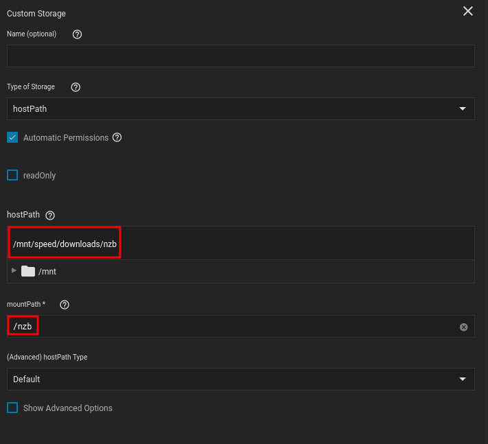
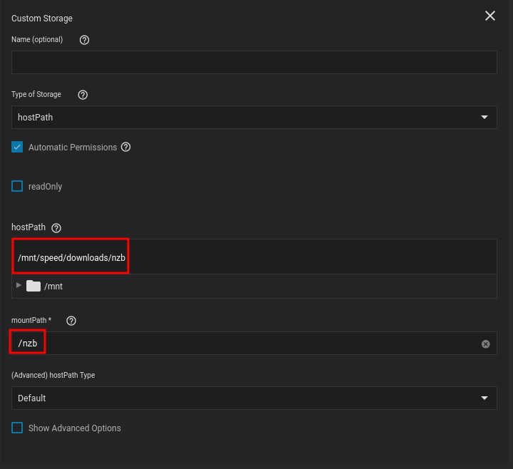
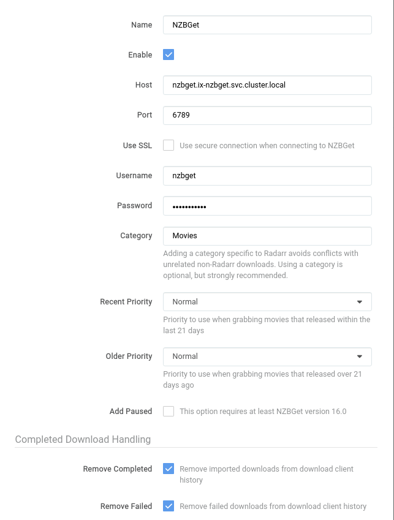

## Mountpoints

Its important to keep your mountpoints for each of the applications the same. Otherwise you will need to setup a `remote path`

- They may be slightly different, but as long as they have the same root directory it will be fine.

 

### Radarrs Storage Settings

### NZBGet Storage Settings

 

## Linking Radarr to NZBGet

### Explanation

??? Radarr "Explanation"

    | Name             	| Value                              	| Reason                                                                                                                                                                                               	|
    |------------------	|------------------------------------	|------------------------------------------------------------------------------------------------------------------------------------------------------------------------------------------------------	|
    | Name             	| NZBGet                             	| Doesn't matter what you call it, just call it something memorable                                                                                                                                    	|
    | Host             	| nzbget.ix-nzbget.svc.cluster.local 	| You will need to generate a different DNS name if your app name is not `nzbget` Generate a new name with [ Truecharts Guide ]( https://truecharts.org/manual/Quick-Start%20Guides/06-linking-apps/ ) 	|
    | Port             	| 6789                               	| This is the default port, but if you changed it then its  [ the only port listed under networking for NZBGet  ](https://heavysetup.info/applications/nzbget/installation/#networking )               	|
    | Username         	| nzbget                             	| Default is `nzbget` but its under your security settings in nzbget                                                                                                                                   	|
    | Password         	| NULL                               	| This is whatever you set during the [NZBGet in app security](https://heavysetup.info/applications/nzbget/in-app/#security ) setup                                                                    	|
    | Category         	| Movies                             	| I want my completed nzbs to be moved to a folder in `completed/Movies` once their done                                                                                                               	|
    | Remove Completed 	| True                               	| You can't seed nzbs, so there's no point in keeping them                                                                                                                                             	|
    | Remove Failed    	| True                               	| No reason to keep failed articles                                                                                                                                                                    	|

 