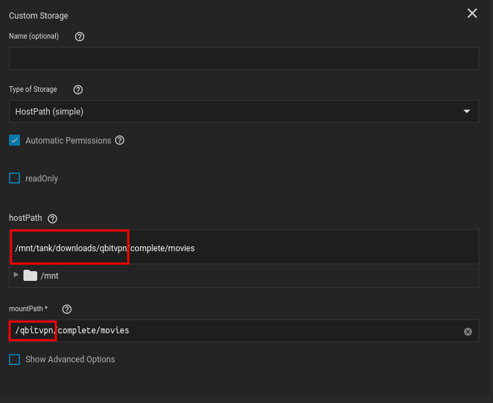
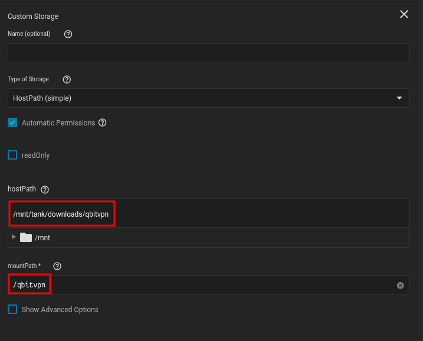
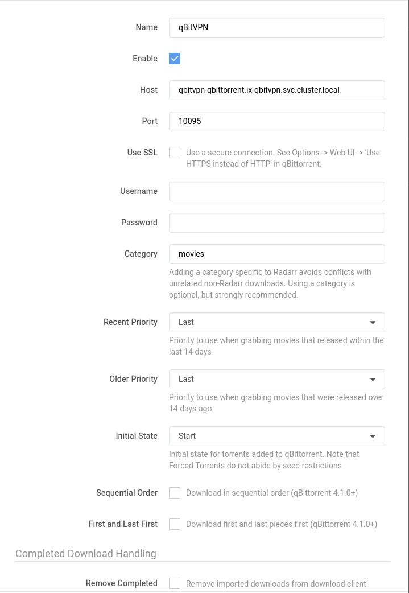

## Mountpoints

Its important to keep your mountpoints for each of the applications the same. Otherwise you will need to setup a `remote path`

- They may be slightly different, but as long as they have the same root directory it will be fine.

 

### Radarrs Storage Settings

I set it to a sub directory of `/qbitvpn` though since `/qbitvpn/complete/movies` is the only directory Radarr needs to see, since it only needs to see movies that are completed

### qBittorrents Storage Settings

 

## Linking Radarr to qBittorrent

### Explanation

??? Radarr "Explanation"

    | Name             	| Value                                            	| Reason                                                                                                                                                                                                	|
    |------------------	|--------------------------------------------------	|-------------------------------------------------------------------------------------------------------------------------------------------------------------------------------------------------------	|
    | Name             	| qbitvpn                                          	| Doesn't matter what you call it, just call it something memorable                                                                                                                                     	|
    | Host             	| qbitvpn-qbittorrent.ix-qbitvpn.svc.cluster.local 	| You will need to generate a different DNS name if your app name is not `qbitvpn` Generate a new name with [ Truecharts Guide ]( https://truecharts.org/manual/Quick-Start%20Guides/06-linking-apps/ ) 	|
    | Port             	| 10095                                            	| This is the default port, but if you changed it then its  [ the first port listed under networking for qbittorrent  ](https://heavysetup.info/applications/qbittorrent/installation/#networking )     	|
    | Username         	| NULL                                             	| You can leave this empty if you followed  [WEBGUI guide](https://heavysetup.info/applications/qbittorrent/in-app/#webgui )                                                                            	|
    | Password         	| NULL                                             	| You can leave this empty if you followed  [WEBGUI guide](https://heavysetup.info/applications/qbittorrent/in-app/#webgui )                                                                            	|
    | Category         	| movies                                           	| I want my completed torrents to be moved to a folder in `completed/movies` once their done                                                                                                            	|
    | Remove Completed 	| False                                            	| I do not want to delete my torrents before their done seeding                                                                                                                                         	|

 