For this application I used the `Custom-App` provided by [TrueCharts](https://truecharts.org/manual/Quick-Start%20Guides/01-Adding-TrueCharts/).

- Available under the `stable` train

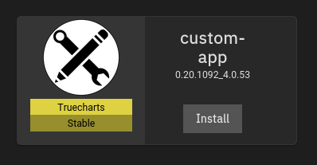

 

## Container

So, this is going to be a bit different, but I actually use custom-app for this application

At the time of creating this application, I needed the additional features only available in the nightly version of the application

However, you would probably be fine setting this up like the Radarr setup (using the regular Truecharts version), as the enhancements are now apart of the stable image

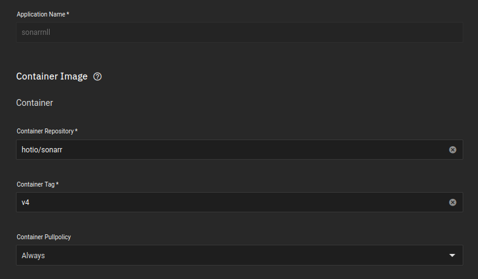

 

## Networking 

If you are wanting to use ingress, its probably better to use clusterIP instead

- I changed the UDP and TCP port to match the Mullvad ports allocated to me

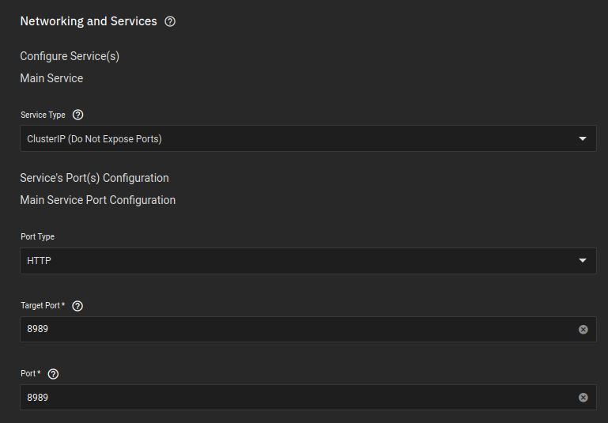

 

## Storage

### Configuration

The setup is default

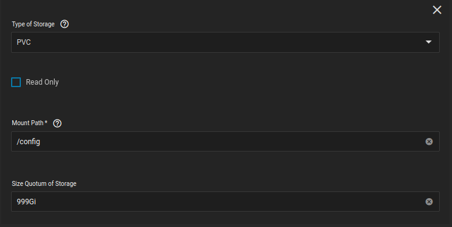

 

### Media - Destination Folders

- Media is so that Radarr will have a location to place files once they're completed
- This will be the folder Radarr places files for plex to then parse through.

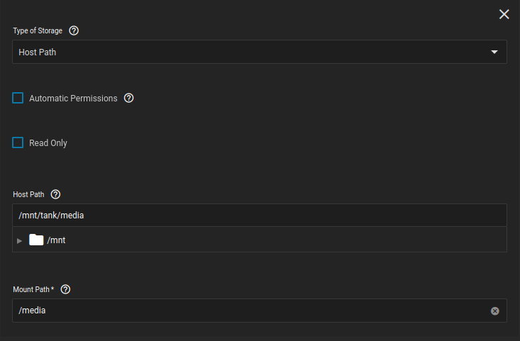

 

### Backups

- '/config/Backups' is the location Radarr places its automatic and manual backups
- I created a separate dataset meant for backups, specifically to have an easy way to restore a backup, in the event the application is wrongly deleted, or removed, corrupt, whatever

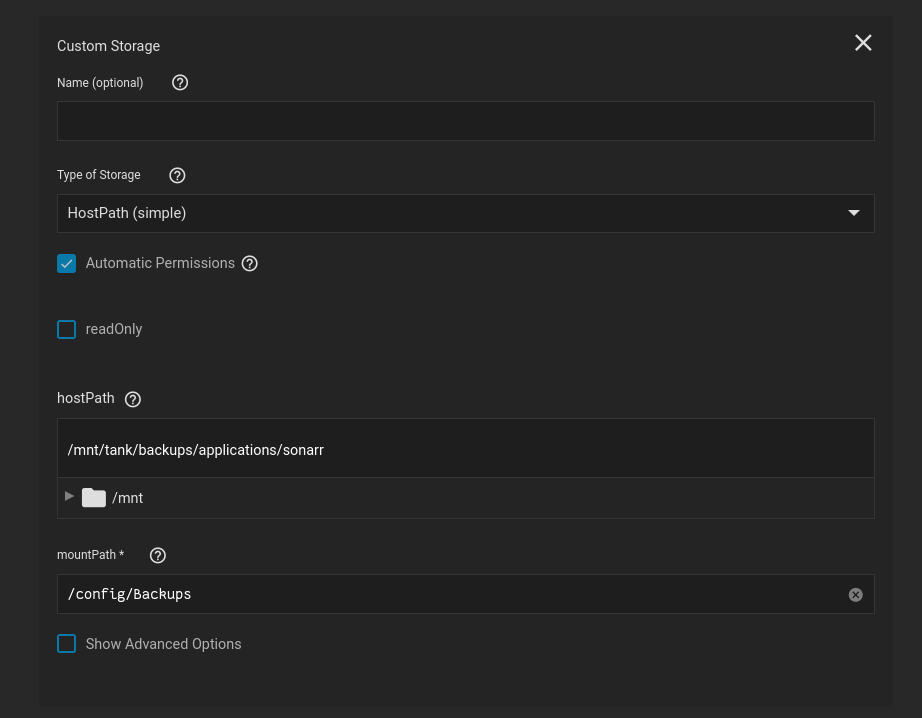

 

### NZB 

- This is obviously the location Radarr will look for completed NZB files
- Its also the location NZBGet saves its completed movie files

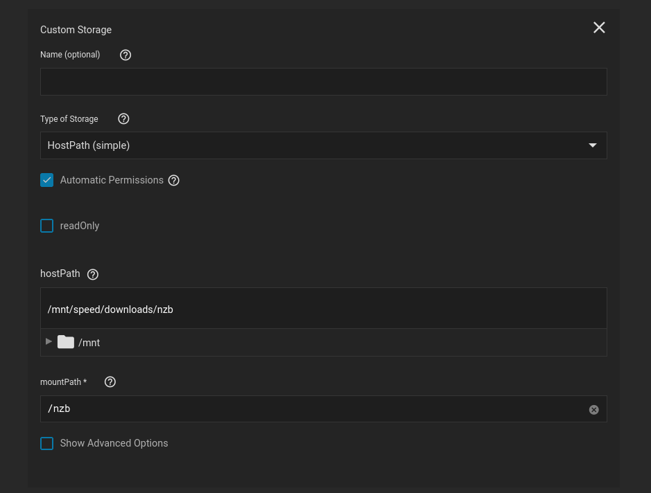

 

### Bittorrent 

- This is the location Radarr will look for completed qBittorrent files
- Its also the location qBittorrent saves its completed movie files

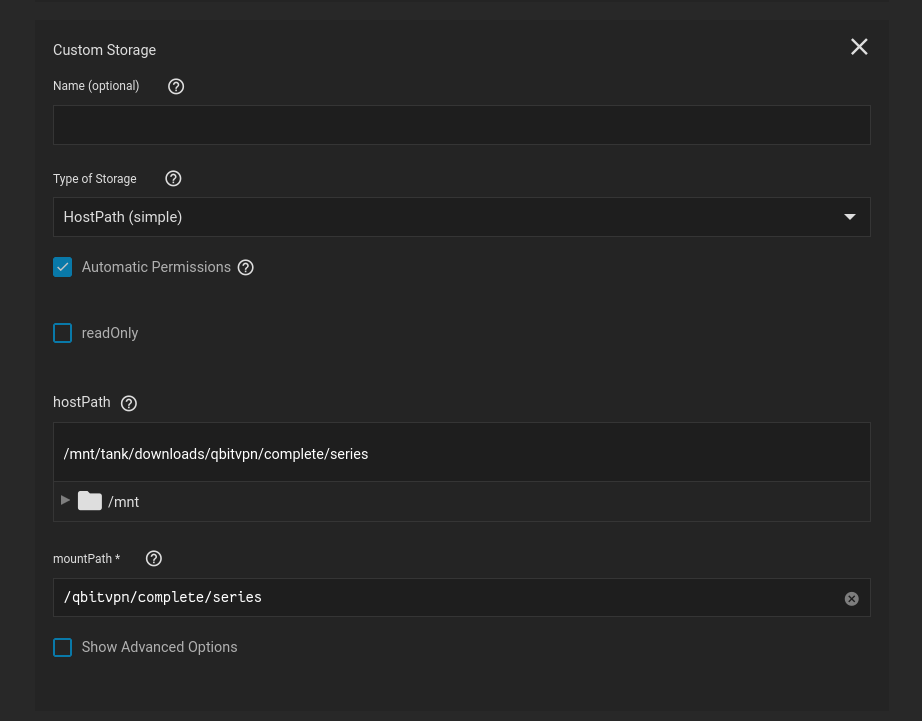

 

### Syncthing

- This is the location Radarr will look for completed Syncthing files
- Its also the location Syncthing saves its completed movie files

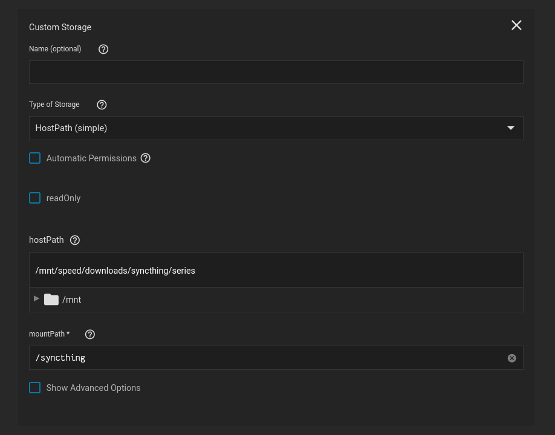

 

## Permissions

Again, you can bypass this step if you use the regular Truecharts version of the Sonarr application

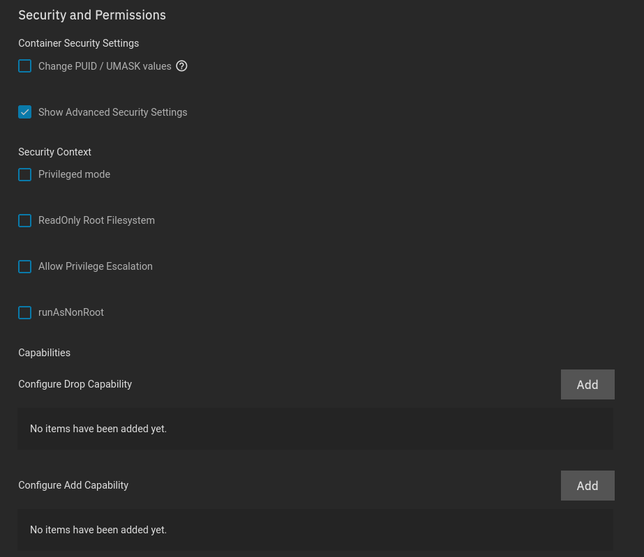

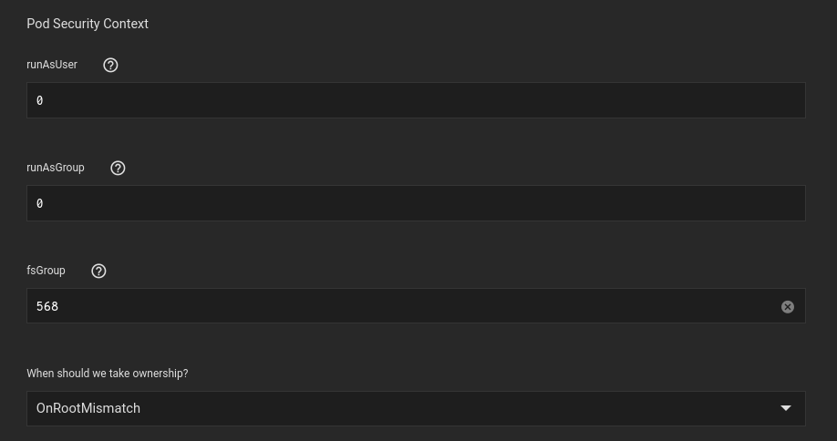

 