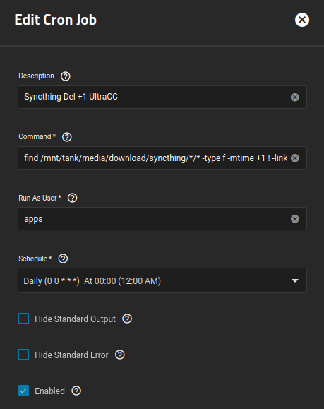

I am running a cron job which find files that are not associated with a hard link, or empty directories, and deletes them.

### Reasoning

My setup has Syncthing pull in files from my remote seedbox, then places them in `/mnt/tank/media/download/syncthing/`, where it is then picked up by Sonarr or Radarr, and __hardlinked__ to my `media` folder, so Plex can see it.

Sometimes there may be residual files that are not associated with a hard link, or empty directories, and I want to delete them.

<br />

### Cron Job

**Command**
```
find /mnt/tank/media/download/syncthing/*/* -type f -mtime +1 ! -links +1 -delete -o -type d -empty -delete
```

**Run As User**
```
apps
```

- Since `apps` is the owner of the dataset, it makes sense to run the command as `apps`

**Schedule**

Up to you, I run mine daily at 12:00 AM




<br />