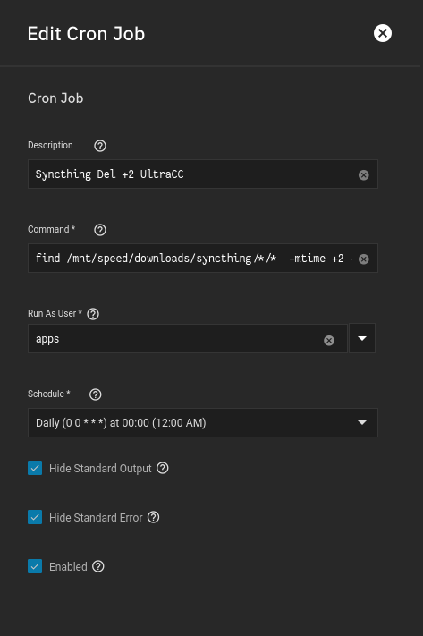

I am running a cron job which find files or folders that have been there for 2 or more days, then deletes them.

### Reasoning

My setup has Syncthing pull in files from my remote seedbox, then places them in `/mnt/speed/downloads/syncthing/`, where it is then picked up by Sonarr or Radarr, and __copied__ to my `media` folder, so Plex can see it.

Well, after those files are __copied__ from my Syncthing folder by Sonarr/Radarr, how are they deleted?

Easy, with the script below tied to a cron job, so we can automatically run the command on our own schedule. 

<br />

### Cron Job

**Command**
```
find /mnt/speed/downloads/syncthing/*/*  -mtime +2 -delete
```

**Run As User**
```
apps
```

- Since `apps` is the owner of the dataset, it makes sense to run the command as `apps`

**Schedule**

Up to you, I run mine daily at 12:00 AM

**Check Boxes**

I hide `Standard Output` and `Standard Error`

- They both produce annoying messages saying that either the file doesn't exist (because it couldn't find a file to delete) or reports "error" messages that really don't matter.



<br />