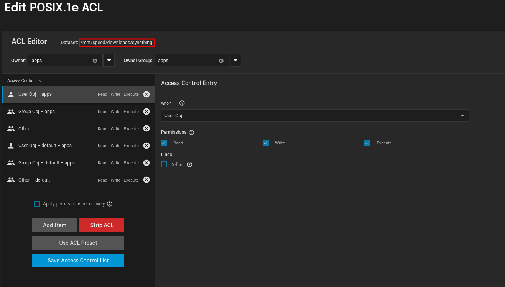

This is another application I had to leave wide-open to get to work properly. 

For some reason, using the regular permissions settings would result in permissions errors off and on, it was incredibly annoying.

So, as you can see I created a `POSIX ACL` and set all of the users to `apps` and I gave `other` full permissions as well.

Unsafe I know, but I really could not find another way to get this working.

