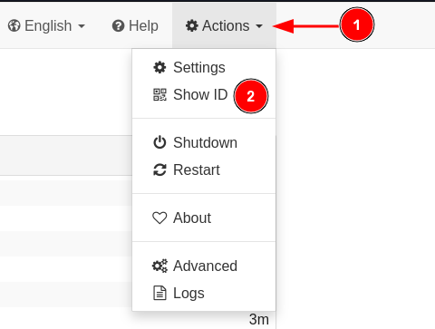
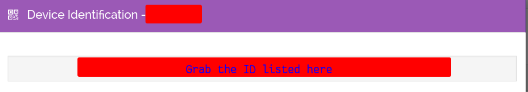
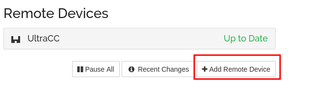
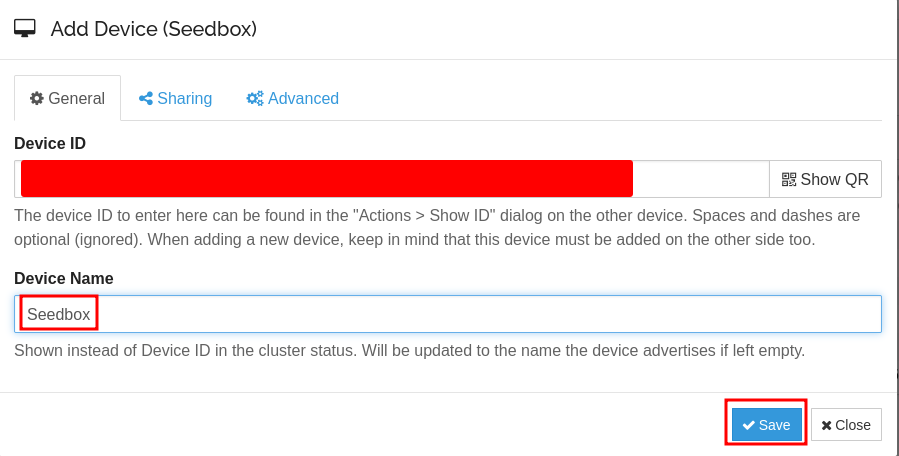
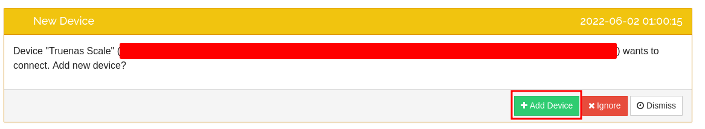
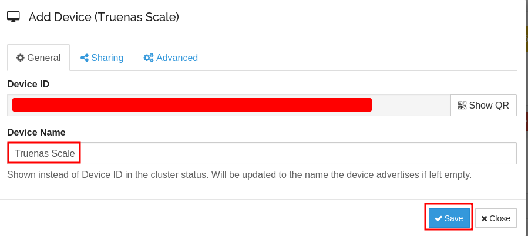
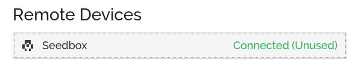

## Connecting Local to Remote

### Copying Remote ID

First, you need to go to your _Seedbox_ Syncthing machine and get its ID.

### Connecting Servers

#### Launching the connection

Second, open your _Truenas_ Syncthing instance and add a new connection

- Click `Add Remote Device`

**Device ID**

> This is the string of text your just copied

**Device Name**

> This is the name you are setting for your Seedbox, I named mine `Seedbox`

Afterwards, Click `Save`, I do not change any settings in the other two columns

 

#### Accepting the Connection

Now, go to your Seedbox Syncthing and you should see this prompt:

- Click `Add Device` if thats the correct device trying to connect

**Device ID**

> This should be pre-filled out, leave it

**Device Name**

> This is the name you are setting for your Truenas Scale Syncthing, I named mine `Truenas Scale`

Afterwards, Click `Save`, I do not change any settings in the other two columns

 

#### Final Result

Now you should have a new device under `Remote Devices`, and it should say `Connected (Unused)`

