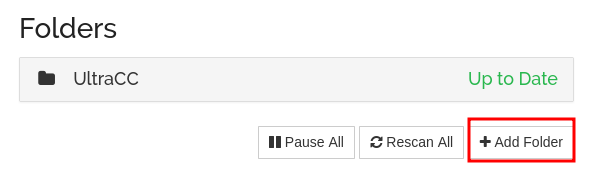
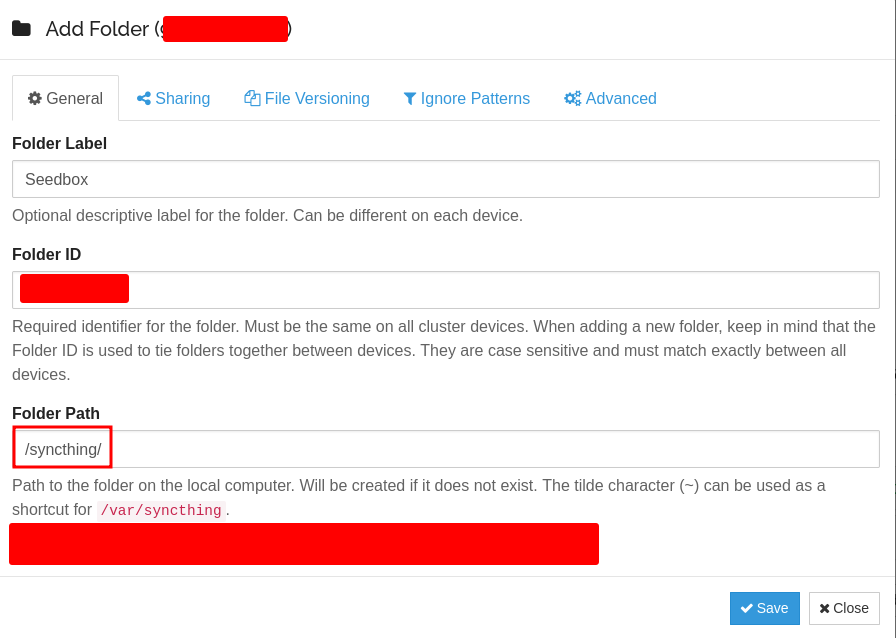
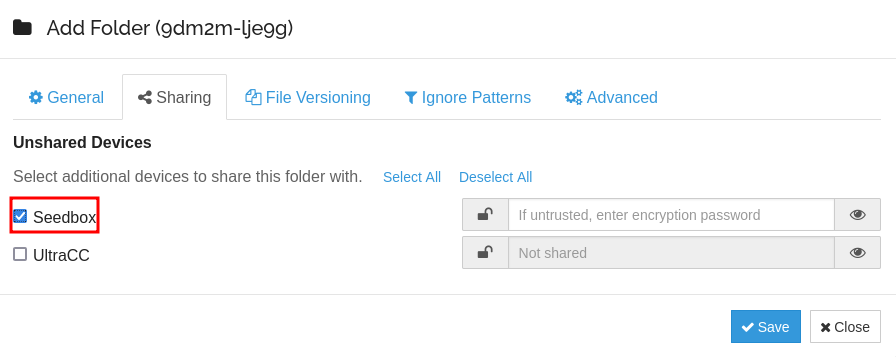
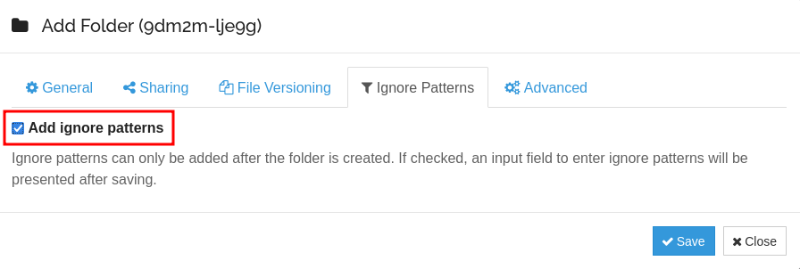
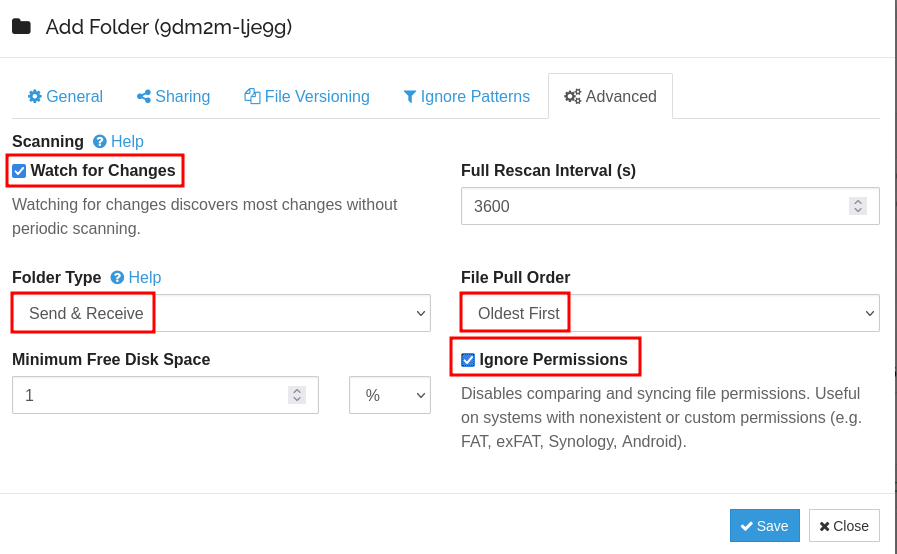
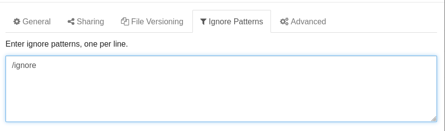
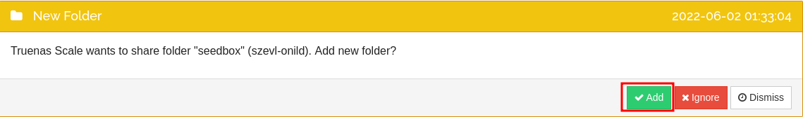
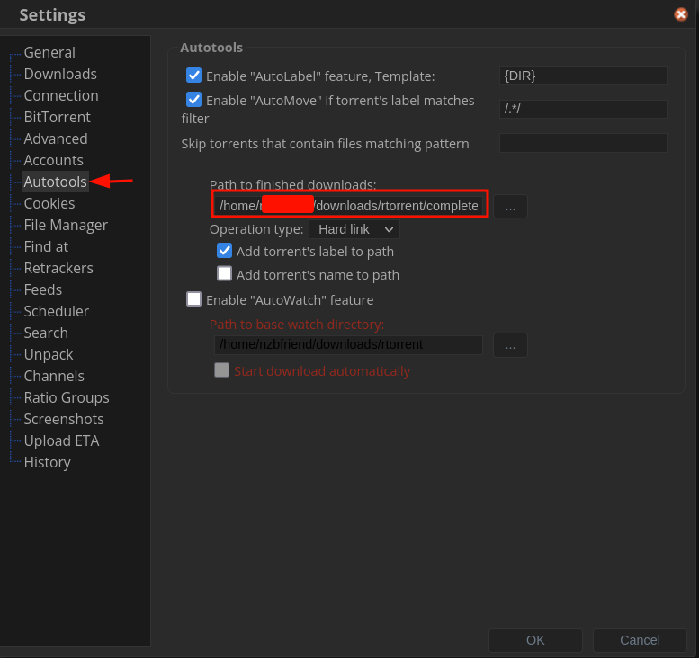
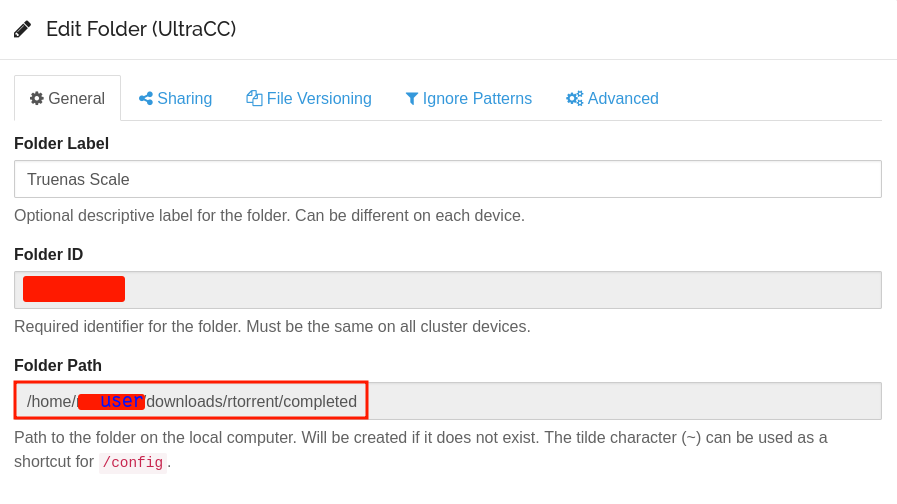

## Local Setup

Click `Add Folder`



### General

**Folder Label** 
> Name this whatever

**Folder ID**
> Pre-filled, ignore it

**Folder Path**
```
/syncthing
```

- This needs to be the same Mount Point you set during [installation](https://heavysetup.info/applications/syncthing/installation/#data)



### Sharing

Check the box next to the server you wish to share this folder with, in my case it is `Seedbox`



### Ignore

Check `Add ignore Patterns`
> After clicking save, a window will come up asking what we want out patterns to be



### Advanced


??? Explanation "Explanation"
    | Name               	| Value          	| Reason                                                                                                                                     	|
    |--------------------	|----------------	|--------------------------------------------------------------------------------------------------------------------------------------------	|
    | Watch For Changes  	| Checked        	| This watches for changes without doing an entire folder scan So when new files are added, it doesn't have to wait for the scan to see them 	|
    | Folder Type        	| Send & Receive 	| This is important for deleting the old hardlinks rTorrent creates                                                                          	|
    | File Pull Order    	| Oldest First   	| I want the file/folder that was FIRST added to the list to be synced Rather than having files come out of order                            	|
    | Ignore Permissions 	| Checked        	| This helps solve the issues with Syncthings weird permissions issue on SCALE                                                               	|



### Ignore Prompt

As of right now I only include `/ignore` in here. This is in the event I want to add something to my my Truenas SCALE folder, but have it NOT sent to my Seedbox Syncthing



<br >

## Remote Setup

Now you need to go to your Seedbox Syncthing and accept the new folder, and fill out the same settings



### General

**Folder Label** 
> Name this whatever

**Folder ID**
> Pre-filled, ignore it

**Folder Path**

The folder path is not as easy as it is to get locally..

This needs to be set to your Bittorrent Completed Downloads folder

If you plan on using my exact setup, expand the option below

??? rTorrent "rTorrent Save Path"
    I use rTorrent, because it actually supports hard-links, unlike pretty much ANY other torrent client for whatever reason..

    We will specifically use the file path listed under `Autotools` -> `Path to finished downloads`, because this is where our hardlinks are created.

    Hard-links are awesome because they create instructions from the completed torrent, to our save location. So theres no need to copy, or move files just to get them to where Syncthing can see them. AND, once the script in the cron job section deletes the file on our Truenas SCALE server, the hard-link is deleted from the Seedbox as well, but the torrents will continue to seed just fine. The link is broken, but the file is untouched.

    





### Sharing

As you can see I re-used the picture from above, since the only thing that will change is the name of the box you tick. 


### Ignore

Check `Add ignore Patterns`
> After clicking save, a window will come up asking what we want out patterns to be


### Advanced

??? Explanation "Explanation"
    | Name               	| Value          	| Reason                                                                                                                                     	|
    |--------------------	|----------------	|--------------------------------------------------------------------------------------------------------------------------------------------	|
    | Watch For Changes  	| Checked        	| This watches for changes without doing an entire folder scan So when new files are added, it doesn't have to wait for the scan to see them 	|
    | Folder Type        	| Send & Receive 	| This is important for deleting the old hardlinks rTorrent creates                                                                          	|
    | File Pull Order    	| Oldest First   	| I want the file/folder that was FIRST added to the list to be synced Rather than having files come out of order                            	|
    | Ignore Permissions 	| Checked        	| This helps solve the issues with Syncthings weird permissions issue on SCALE                                                               	|


### Ignore Prompt

As of right now I only include `/ignore` in here. This is in the event I want to add something to my seedbox, but NOT have it sent to my Truenas Scale Syncthing, I will simply save it to the `ignore` category in rTorrent, and it will be ignored


<br >