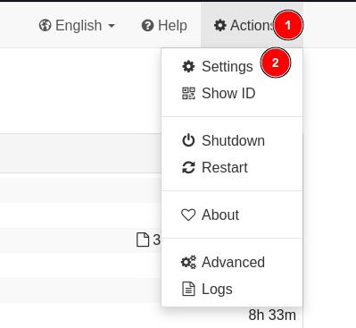
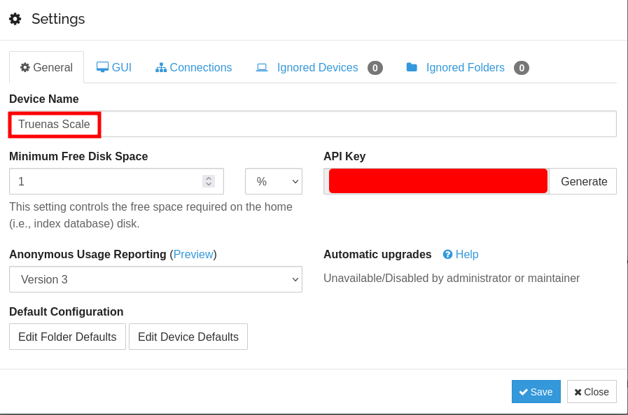
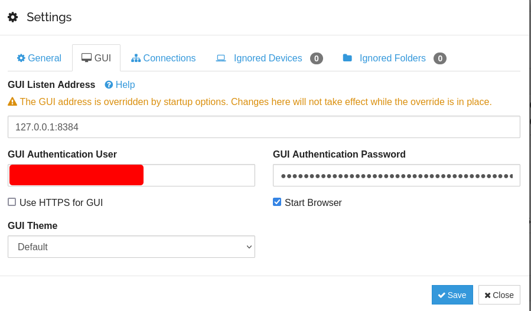
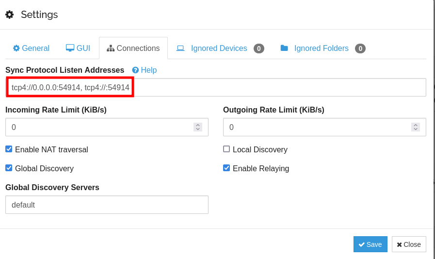

## Settings



<br >

### General

Only thing I changed was my `Device Name` on here, this is unimportant and up to you.



<br >

### GUI

Changed my Username/Password



<br >

### Connections

I was having issues with Synthing ONLY using a relay connection, which resulted in a super slow download speed from my Seedbox. The solution was to use the following format. 

If you are still having an issue with relaying, you can try un-ticking the `Enable Relaying` box, but I didn't, because I still want a fallback option incase for whatever reason my port forwarding fails. 

**Sync Protocol Listen Addresses**
```
tcp4://0.0.0.0:54914, tcp4://:54914
```

??? Note "Note"
    You should be using whatever port is listed in your [Networking Listening Ports](https://heavysetup.info/applications/syncthing/installation/#listening-ports)




<br >
