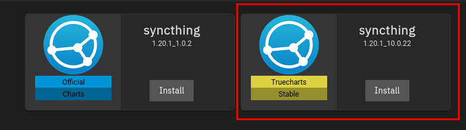
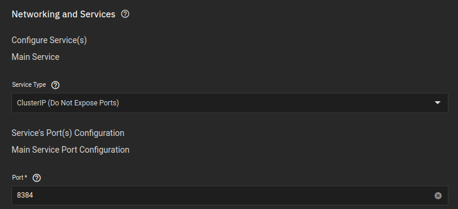
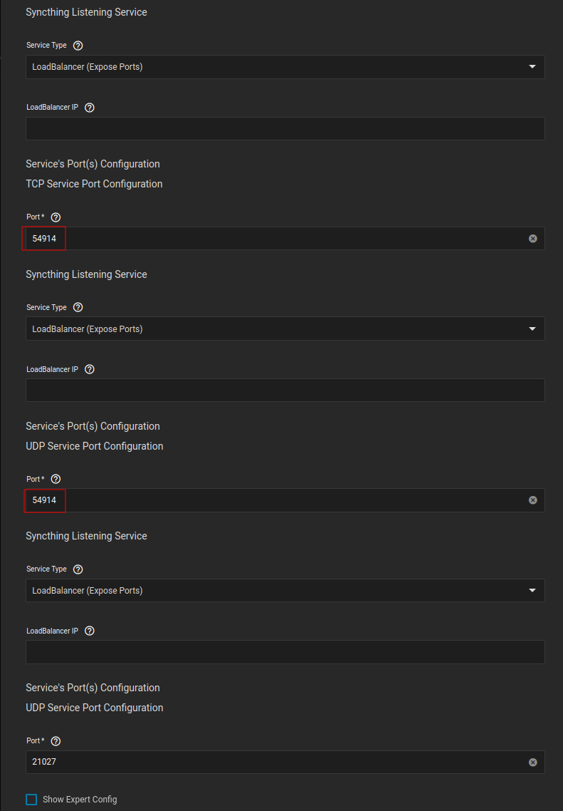
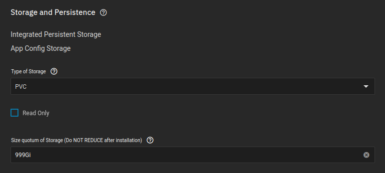
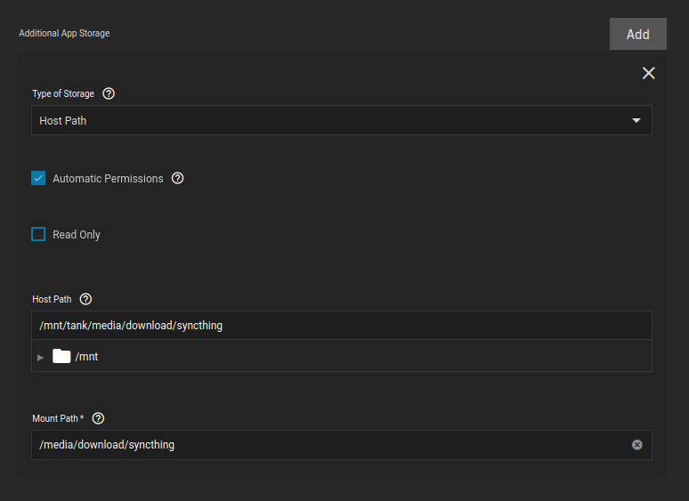
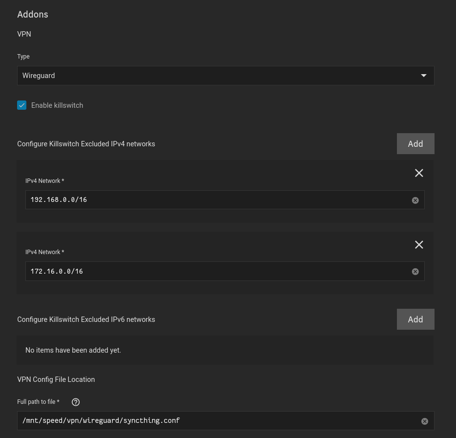

## Container

For this application I used `Syncthing` provided by [TrueCharts](https://truecharts.org/manual/Quick-Start%20Guides/01-Adding-TrueCharts/).

- Available under the `stable` train

 

## Networking 

### WebUI

I personally use clusterIP, because I use ingress for all of my applications

- You may want to keep this on LoadBalancer, if you are not using ingress

### Listening Ports

**These are the ports your other Syncthing service will connect to. You will need to either: **

??? VPN "If you are using a VPN"

    - Port forward this port on whatever VPN service you are using, as I have stated, I am using Mullvad
    - You only need to change the first TWO ports (marked with red), not the last port

??? VPN "If you are NOT using a VPN"

    - Port forward this port on your router
    - Also, if you are NOT using a VPN you can leave the two ports default, the only reason I changed my port is because Mullvad does not give you the option to choose which port to use

 

## Storage

### Configuration

The setup is default

### Data

- media is the dataset I created for my media here: [Folder Structure](general_guides/folder_structure/dataset.md)
- media is also the dataset that hosts all nested folders for my media, as shown in the tree structure here: [Folder Structure](general_guides/folder_structure/about.md#tree)
- Qbittorrent only needs to access the `/media/download/syncthing` folder, so I gave it access to that folder only
- Sonarr/Radarr will be able to hardlink files from the download directory, since they both will be seeing the folders they require

 

## VPN

- Using a Wireguard setup
- Added the kubernetes network, as well as my LAN network to the killswitch
- Using a VPN for this application is in no way mandatory at all, I just simply felt safer transmitting data encrypted

 