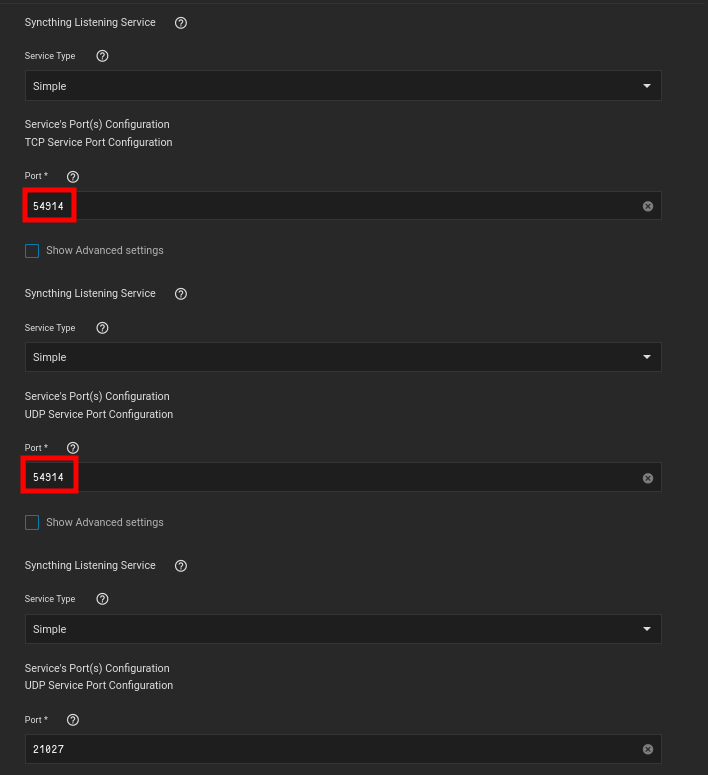
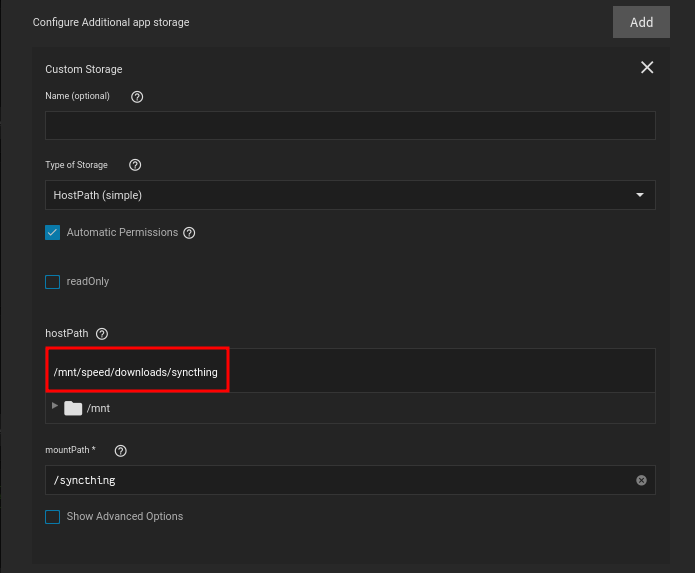

## Networking 

If you are wanting to use ingress, its probably better to use clusterIP instead

- I changed the UDP and TCP port to match the Mullvad ports allocated to me

 

## Storage

### Configuration

The setup is default

### Data

I always mount to the root directory of the container

I also try to use the applications name for the mountpath, since its typically never going to be a file or folder thats already present 

 

## VPN

- Using a Wireguard setup
- Added the kubernetes network, as well as my LAN network to the killswitch
- Using a VPN for this application is in no way mandatory at all, I just simply felt safer transmitting data encrypted

 