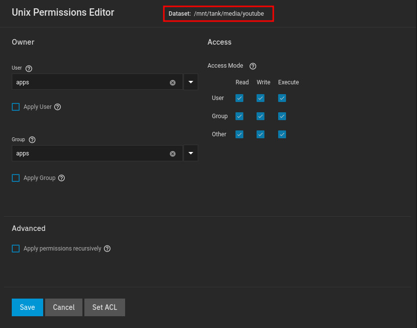

**This is the location your videos will be stored, you can skip this step if you are fine with just using PVC instead**

As you can see I created a dataset in `media`, since this is media after all.

Unfortunately, I could not find a way to run this application without using 777.. 

But as you can see I left the permissions wide open, and set the user:group to `apps`

