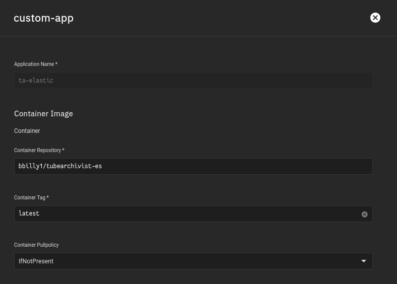
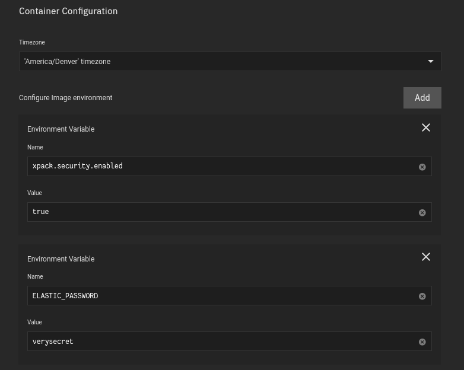
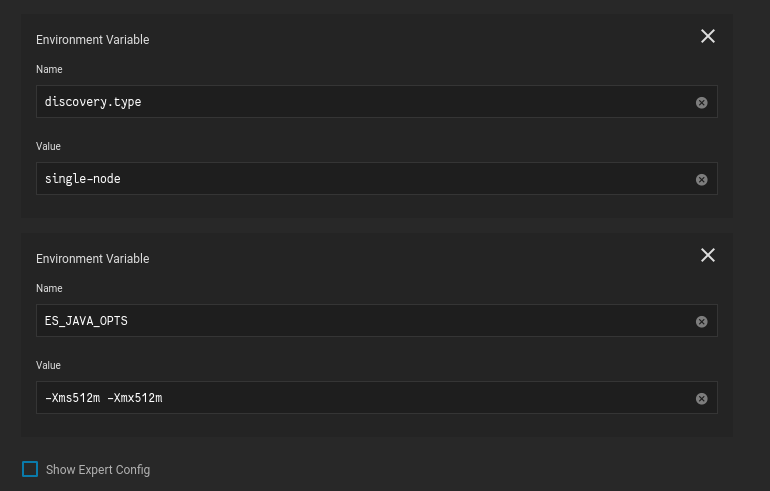
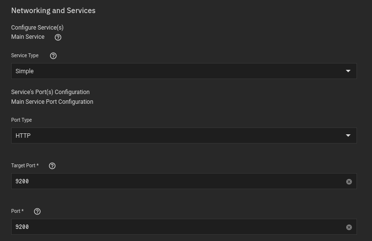
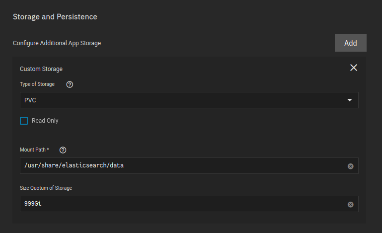
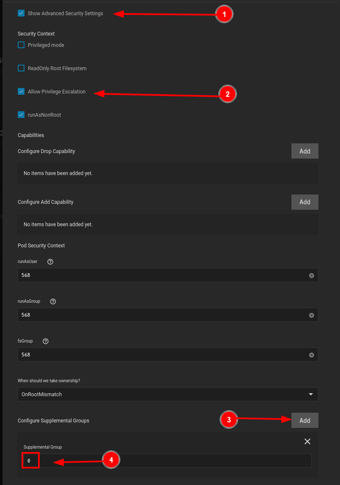
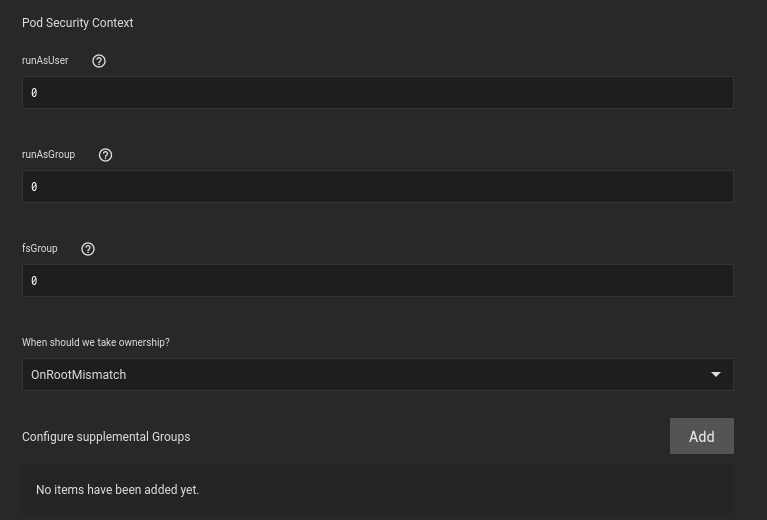

For this application I used the `Custom-App` provided by [TrueCharts](https://truecharts.org/manual/Quick-Start%20Guides/01-Adding-TrueCharts/).

- Available under the `stable` train


<br />

## Container 

**Application Name**
```
ta-elastic
```
The name is very important, as it determines our DNS names, which is how we are going to connect the applications together..

You don't HAVE to follow my naming scheme, but if you don't, you'll have to also change your DNS name

**Container Repository**
```
bbilly1/tubearchivist-es
```
**Container Tag**
```
latest
```



<br />

## Environment Variables

**Name**
```
xpack.security.enabled
```
**Value**
```
true
```
<br />

**Name**
```
ELASTIC_PASSWORD
```
**Value**
```
verysecret
```



**Name**
```
discovery.type
```
**Value**
```
single-node
```

<br />

**Name**
```
ES_JAVA_OPTS
```
**Value**
```
-Xms512m -Xmx512m
```



<br />


## Networking

**Target Port**
```
9200
```
**Port**
```
9200
```



<br />

## Storage

- I am using PVC in this case since this is not something the user will need to interact with 

Ensure the mountpath is:
```
/usr/share/elasticsearch/data
```

Elasticsearch specifically looks to that mount point, its required




<br />

## Security

Running the application without user:group `0` or `root`, resulted in the container not starting.



- Also, in this case, `fsgroup` was also required to be `0`



<br />