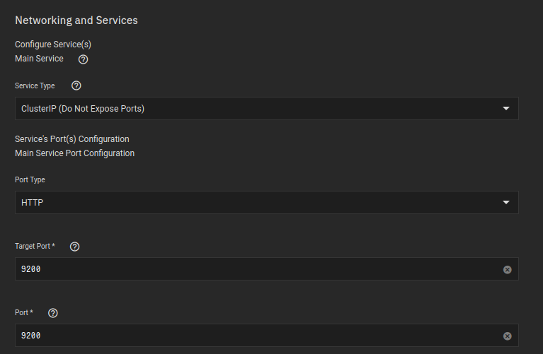

For this application I used the `Custom-App` provided by [TrueCharts](https://truecharts.org/manual/Quick-Start%20Guides/01-Adding-TrueCharts/).

- Available under the `stable` train


<br />

## Container 

**Application Name**
```
ta-elastic
```
The name is very important, as it determines our DNS names, which is how we are going to connect the applications together..

You don't HAVE to follow my naming scheme, but if you don't, you'll have to also change your DNS name

**Container Repository**
```
bbilly1/tubearchivist-es
```
**Container Tag**
```
latest
```


<br />

## Environment Variables

**Name**
```
xpack.security.enabled
```
**Value**
```
true
```
<br />

**Name**
```
ELASTIC_PASSWORD
```
**Value**
```
verysecret
```


**Name**
```
discovery.type
```
**Value**
```
single-node
```

<br />

**Name**
```
ES_JAVA_OPTS
```
**Value**
```
-Xms512m -Xmx512m
```


<br />


**Name**
```
path.repo
```
**Value**
```
/usr/share/elasticsearch/data/snapshot
```


<br />

## Networking

**Target Port**
```
9200
```
**Port**
```
9200
```


> ClusterIP is being used since no other services besides TA will be accessing this container, so the port only needs to be exposed within the kubernetes network. 


<br />

## Storage

- I am using PVC in this case since this is not something the user will need to interact with 

Ensure the mountpath is:
```
/usr/share/elasticsearch/data
```

Elasticsearch specifically looks to that mount point, its required


> You of course can change `Size Quotum of Storage` to something lower. I cannot though. I would recommend setting it to something a bit lower. You will receive a notification on Truenas if your PVC is filling up, so you can expand the size, but you cannot EVER retract to a lower size later on. 

<br />

## Security

1. Select __Show Advanced Security Settings__

2. Select __Allow Privilege Escalation__

3. Next to __Configure Supplimental Groups__ Select __Add__

4. Input `0` under __Supplimental Group__


<br />