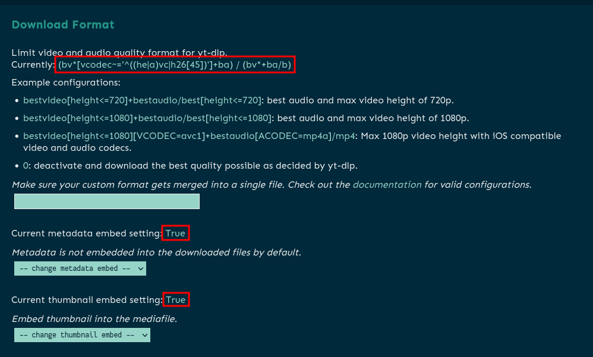
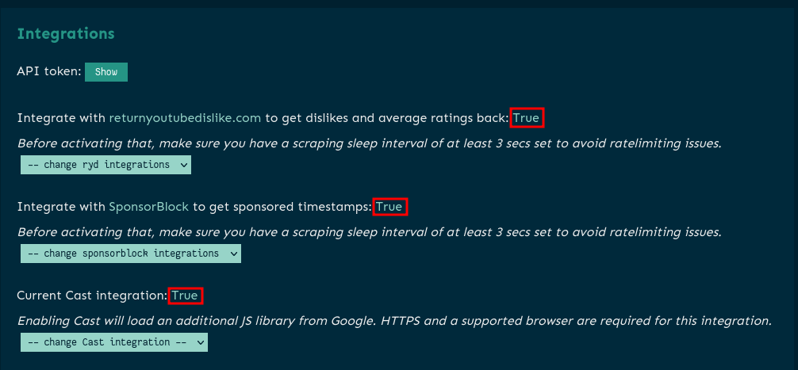
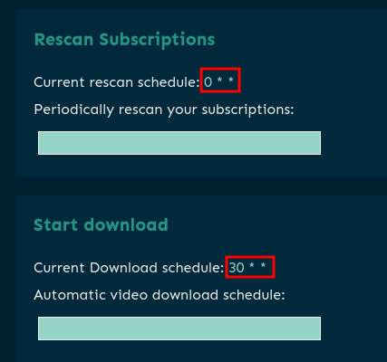

Theres nothing specific to Truenas Scale after setting up your application. 

I will still however, share my settings.

## Download Format

This is completely subjective, and I am also continuously changing this setting until I land on something that I like. 

However, this is what I am currently using:
```
(bv*[vcodec~='^((he|a)vc|h26[45])']+ba) / (bv*+ba/b)
```

Current metadata embed setting: `True`

Current thumbnail embed setting: `True`




<br />

## Integrations

Integrate with returnyoutubedislike.com to get dislikes and average ratings back: `True`

- I like to be able to see dislikes on videos


Integrate with SponsorBlock to get sponsored timestamps: `True`

- Skips in-video advertisements

Current Cast integration: `True`

- Ability to chromecast your videos



<br />

## Scheduler Setup

**Rescan Subscriptions**
```
0 * * 
```

- Scans subscriptions for new videos every hour

**Start download**
```
30 * *
```

- Downloads new videos picked up by `Rescan Subscriptions` every hour, on the 30 minute mark



<br />