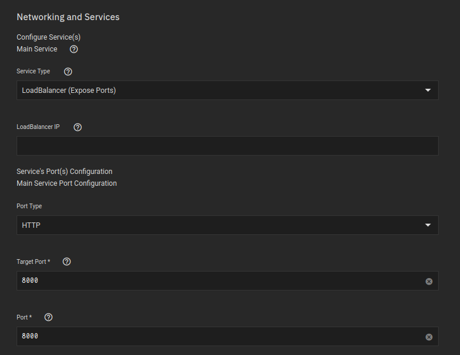
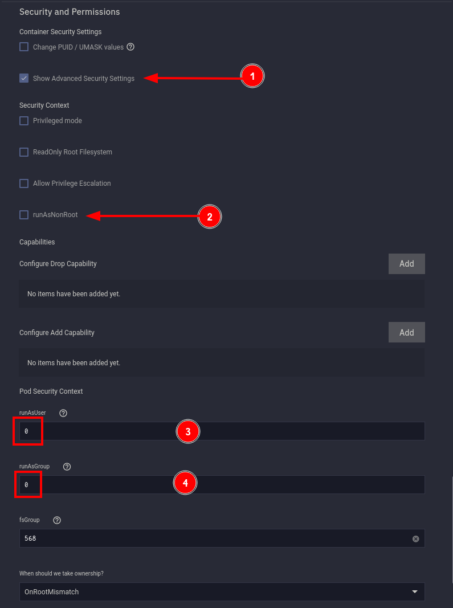

For this application I used the `Custom-App` provided by [TrueCharts](https://truecharts.org/manual/Quick-Start%20Guides/01-Adding-TrueCharts/).

- Available under the `stable` train


<br />

## Container 

**Container Repository**
```
bbilly1/tubearchivist
```
**Container Tag**
```
latest
```


<br />

## Environment Variables

**Name**
```
ES_URL
```
**Value**
```
http://ta-elastic-custom-app.ix-ta-elastic.svc.cluster.local:9200
```
<br />

**Name**
```
REDIS_HOST
```
**Value**
```
ta-redis-custom-app.ix-ta-redis.svc.cluster.local
```


**Name**
```
TA_USERNAME
```
**Value**
```
USERNAME
```

<br />

**Name**
```
TA_PASSWORD
```
**Value**
```
PASSWORD
```

<br />

**Name**
```
ELASTIC_PASSWORD
```
**Value**
```
verysecret
```


<br />


**Name**
```
TA_HOST
```
**Value**
```
youtube.myserver.com
```

>If you are NOT using a reverse proxy, put your IP address here instead


<br />

## Networking

### Ports

**Target Port**
```
8000
```
**Port**
```
8000
```




### DNS

A change is required here, otherwise sometimes the application will start and will be unable to find the `redis` and `elastic search` containers by DNS name

**dnsPolicy**
```
ClusterFirst
```


<br />

## Storage

- Used the same dataset we created earlier
- This is where your data, or videos are going to be actually stored
- You could instead use PVC if you would like to, but since my applications are not on the same pool as my storage tank, it would be a bad idea for me personally

Ensure the mountpath is:
```
/youtube
```

TubeArchivist specifically looks to that mount point, its required


<br />

- Used pvc just for the cache, its likely to just be small files the user will never have to interact with anyway

Ensure the mountpath is:
```
/cache
```


<br />

## Security


1. Select __Show Advanced Security Settings__

2. UN-Select __runASNonRoot__

3. Change __runAsUser__ to `0`

4. Change __runAsGroup__ to `0`

>Running the application without user:group `0` or `root`, resulted in a Django import error.




<br />