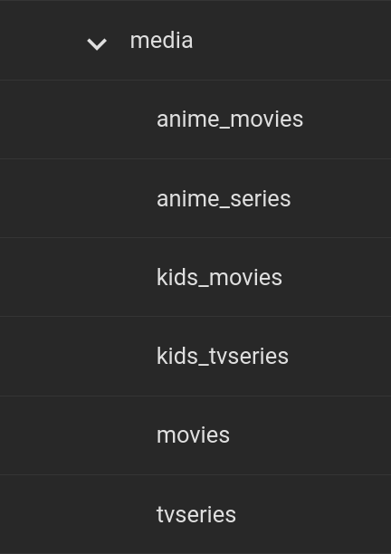
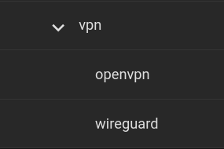
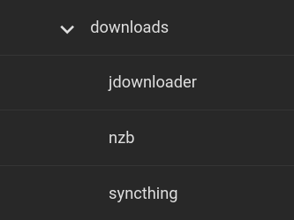

# Folder Structure

## General Guide for Folder Layouts

Things to avoid

- Spaces in folder names
- Capitalization 
- Any sort of special character besides "_" or "-"

 

## Media Folders

Tips

-  Spread out your media folder in a way plex can understand 
    - Such as separating series from movies

 

## VPN Folders

Tips

- Separate OpenVPN files from Wireguard

 

## Download Folders

Tips 

- Separate all download clients into their own dataset