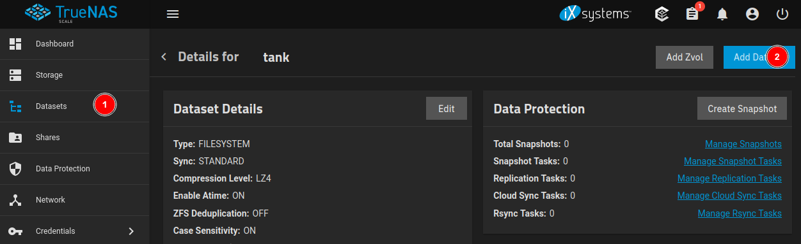
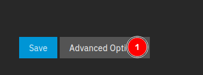
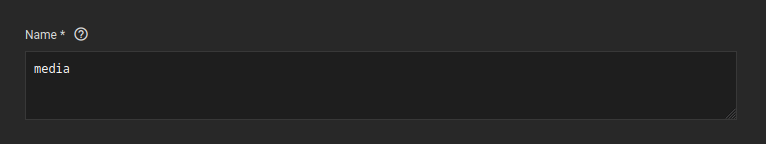
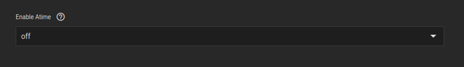
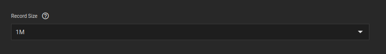
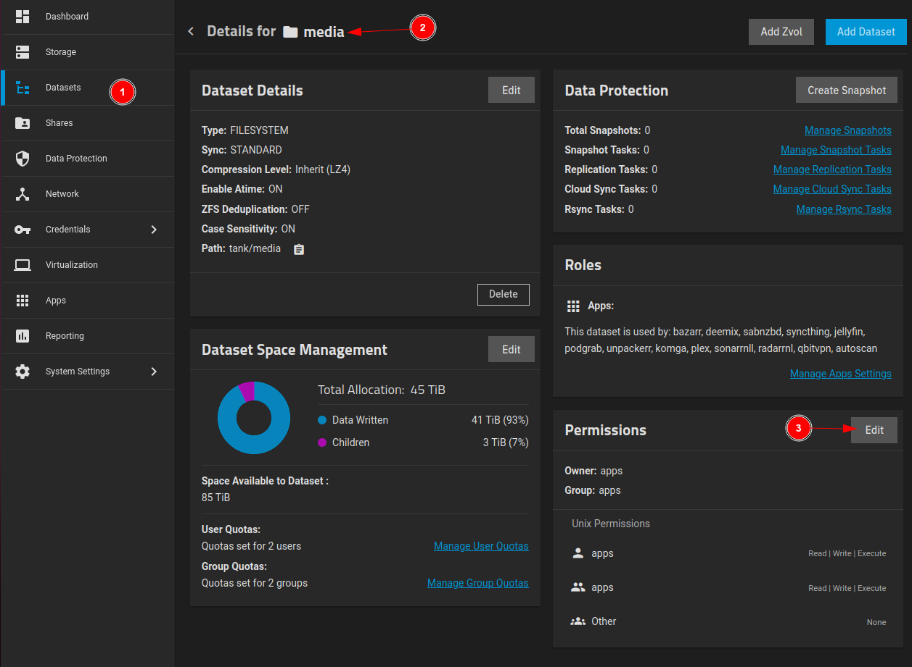
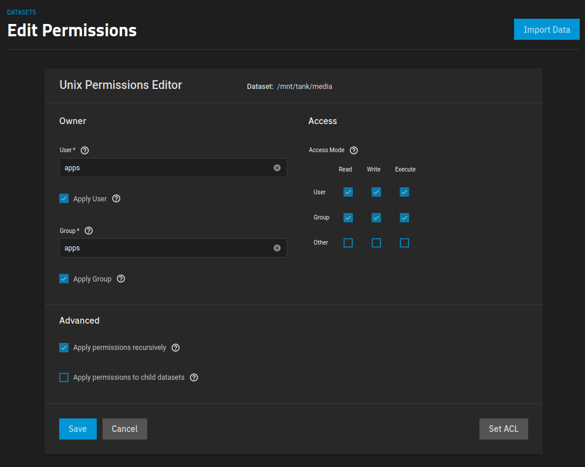

## Creating a Media Dataset

This guide will help you create a well-organized media dataset to easily manage and maintain your media files. Following this structure will ensure smooth navigation and better performance.



<br >

Scroll down to the bottom and click Advanced Options.



<br >

Set the name of the dataset to a suitable name that represents its purpose. In this example, we use "media."



<br >

Following Trash-Guides' recommendation, set Enable Atime to "off." Disabling Atime reduces unnecessary disk writes by preventing updates to the access time attribute when files are read. This can improve overall performance and extend the life of your storage.



<br >

As Trash-Guides suggests, set Record Size to "1M." This optimizes the dataset for media files, which are typically larger than general-purpose files. A larger record size can provide better throughput and reduce fragmentation for large files.




*I left everything else as default, but you can change them to your liking.*

*I also do not enable encryption, since I believe it causes issues with applications.*

<br >
<br >

## Creating Folders

If you would like to copy my folder structure, you can use the following commands to create the folders:

```bash
mkdir -p /path/to/media/{download/{usenet,torrent,syncthing},library/{movies/{anime,kids,standard},series/{anime,kids,standard},music}}
```
> Replace /path/to/media with the path to your media dataset.

Example:

```bash
mkdir -p /mnt/tank/media/{download/{usenet,torrent},library/{movies/{anime,kids,standard},series/{anime,kids,standard},music}}
```

<br >

Or you can create the folders manually.

Ultimately, the folder structure is up to you. You can create as many folders as you want, and you can organize them however you want. The only thing that matters is that you have a folder structure that works for you, and that the folders are created under the media dataset.

<br >
<br >

## Permissions

Navigate to the media dataset and click the Permissions tab.



<br >

Set the following permissions:



> Since all applications will be running as the "apps" user, I set the user and group to "apps." Not setting the user and group to "apps" will cause issues with permissions.