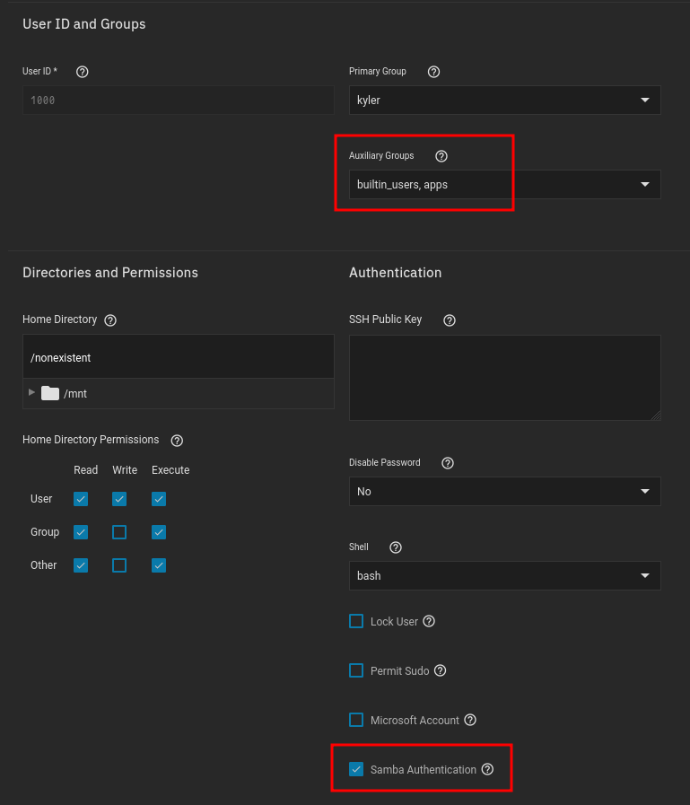
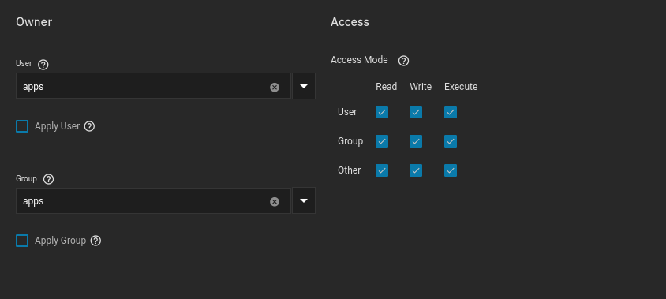
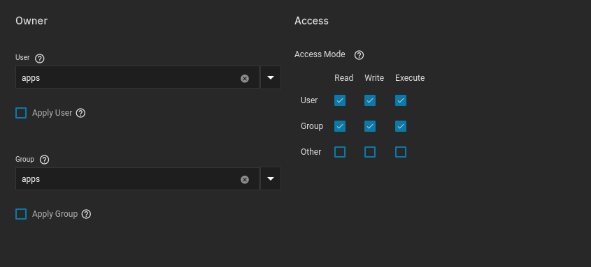

# Application Dataset Permissions

This is, and probably always will be a hot topic for Truenas SCALE

Hopefully this guide will help clear up a few issues. 

 

## User:Group

Pretty much every application runs as `apps`:`apps` (`user`:`group`)

Theres a single application that I _don't_ change to `apps` and simply just use one of the permissions listed below, and that application is `syncthing`.

 

## SMB User Access

This issue is solved simply by adding your SMB user to your `apps` group. That way, and dataset `apps` has access to, so will your SMB user.

1. Truenas Scale GUI
2. Credentials
3. Local Users
4. Click on your user
5. Click edit
6. Click dropdown menu for `auxiliary groups`
7. Select `apps`
8. Ensure `Samba Authentication` is ticked
9. Save

It should look like this once you're done:

 

## Start Off Open

I know, but the idea is to start off open, see if the application will run with no issues, then start closing off permissions.

Example of an open Dataset:

 

## After Testing

After making sure the example above works, I switch to something like this:

- The `other` group/user no longer has access to the files, which is what we obviously want to aim for

- This is what most of my applications will run with 

 