## The Menu

The menu is a nice shortcut to any HeavyScript utilities you could need


You can access the menu simply by running 

```
bash heavyscript.sh
```

or

```
bash /path/to/script/heavyscript.sh
```

<br >

All of the options do just what you would expect

1. Opens the help menu, so you can see all of the options for the script
2. Lists all of your internal DNS names and their ports
3. Opens the Mount and Unmount feature, so you can mount your volumes
4. Opens the Backup Menu
> ix-application backups
5. Updates HeavyScript to the latest github release
6. Opens a menu to create, then run a HeavyScript update
7. List all of your applications, so you can open a shell or send a command to the container/pod

<br >
<br >

## Listing DNS Names

This is useful for when you cannot figure out the internal DNS, and port that you need to use when linking applications together

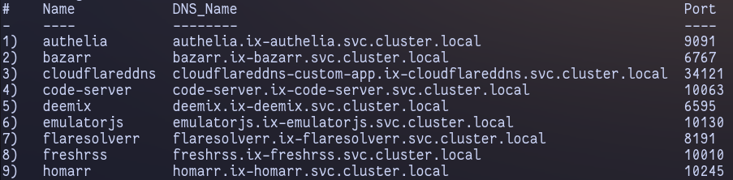

> This is what it looks like, as you can see it shows the DNS name, followed by the port

<br >

__Get to this by either using __

```
bash heavy_script.sh --dns
```

or by using the menu

```
bash heavy_script.sh 
```

<br >
<br >

## Mounting PVC

Finally, an easy to use mounting feature, so you don't have to do that long process yourself

If you don't know, lots of applications use containerized storage, which is unaccessible from your filesystem on your server UNTIL you mount the containers volume. The way to do that manually is long, and a pain, so I created a function within HeavyScript to do it all for you

<br >

The first menu appears like this:

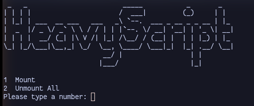
> If you choose `1`, it will list all of your applications, and their volumes as shown below

> If you choose `2`, it will unmount ALL of the volumes that were mounted with the script

<br >

And the second menu:

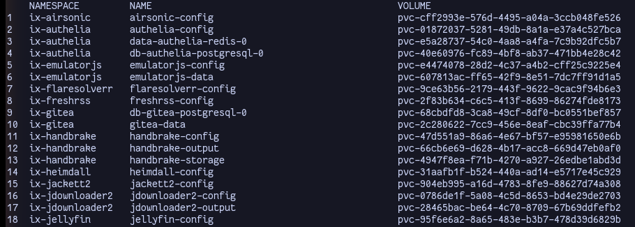
> Type the number associated with the volume you wish to mount, it will:
>> 1. Shutdown that application
>> 2. Mount it under `/mnt/heavyscript/`

<br >

To unmount, simply open the menu again and choose option 2 to unmount everything
> You NEED to do this before attempting to start the application

__Get to this by either using __

```
bash heavy_script.sh --mount
```

or by using the menu

```
bash heavy_script.sh 
```


<br >
<br >


## Restoring Backup

This is useful for when you absolutely destroyed all of your applications, or messed up your kubernetes cluster

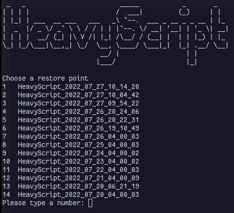
> Lists out each backup from newest to oldest

> After selecting a backup by typing the number to the left of it and pressing enter, HeavyScript will prompt you to confirm your decision before actually restoring that backup

This process takes a long time, so just be patient


__Get to this by either using __

```
bash heavy_script.sh --restore
```

or by using the menu

```
bash heavy_script.sh 
```

<br >
<br >

## Deleting Backup

This is useful for when you need to delete backups one by one, from other scripts, or if you simply just have too many backups


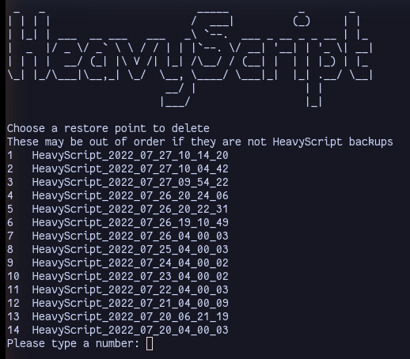

> Lists out each backup from newest to oldest

> After selecting a backup by typing the number to the left of it and pressing enter, HeavyScript will prompt you to confirm your decision before actually deleting that backup

__Get to this by either using __

```
bash heavy_script.sh --delete-backup
```

or by using the menu

```
bash heavy_script.sh 
```

<br >
<br >

## Updating Applications

Allows you to create a `bash heavy_script.sh` update with interactive options

<br >

The first Menu:

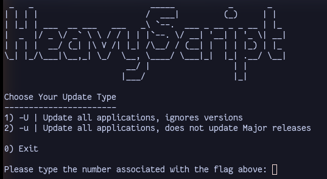
> Type the number associated with the option you want

<br >

It will then ask how many applications you would like to update at once 

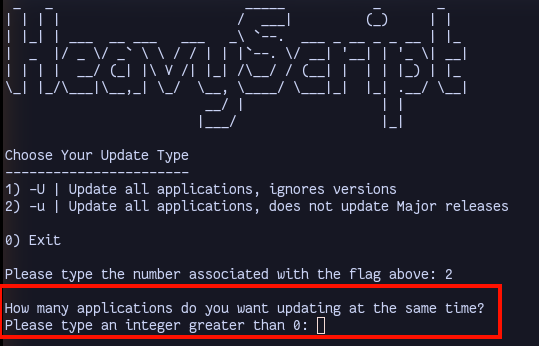
> Type a number greater than 0

<br >

Finally, you can make your selections

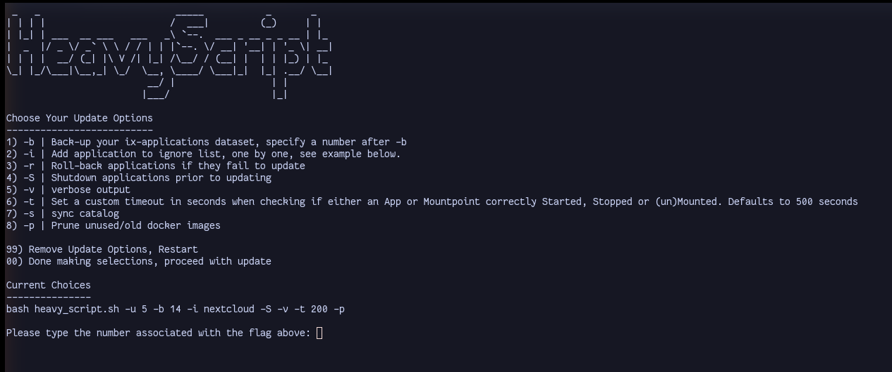
> After you make a selection, it will appear under `Current Choices`

> After you finish up, you can type `00` and the update with your options will begin!

<br >

__Get to this by__

Using the menu

```
bash heavy_script.sh 
```


<br >
<br >

## Command to Container

Allows you to easily open a menu to send a command to one of your containers/pods

<br >

The first Menu:

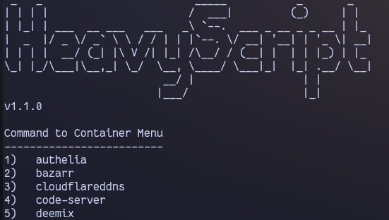
> Type the number associated with the option you want

<br >

If multiple containers are available for that application, it will ask which container you would like

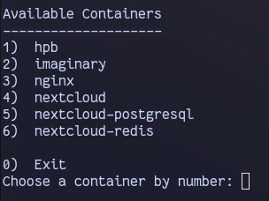
> Type the number associated with the option you want

<br >

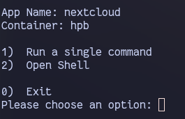
> It will now show your App selection and container selection

<br >

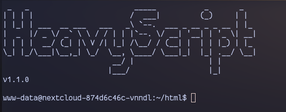
> After choosing option 2, you will be in the containers shell, exit this shell by typing `exit` then pressing `enter`